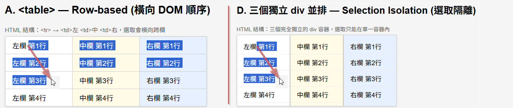
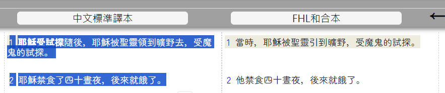
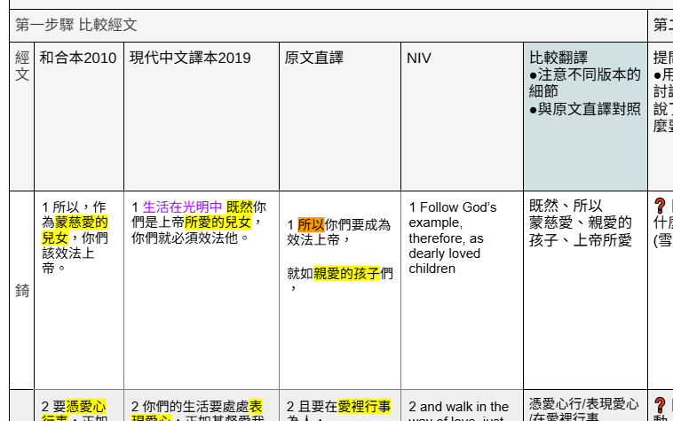
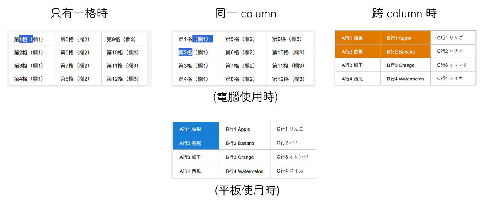

# table selection

### 前言

- 聖經是 table
  - 因為聖經有多譯本，所以本質上，它的顯示應該是 table。
- table html
  - table tag 雖然是直覺，但有許多 layout (排版) 的工具，例如 flewbox 之類的。
- 原因 - 為何當初不使用 table
  - 如下圖，使用 table 的選取文字時，通常期待是像右側方式。(只想 copy 某個譯本)
  - 但 table 預設會左邊這樣，你滑鼠從 row 0, col 0 到 row 2, col 0，但其它譯本會反白

圖示: 選取文字時，通常是專注其中一個譯本，所以期待是(右側)這樣。

圖示: 目前 NUI 也的確是這樣。

### 動機

- 需要複製 table
  - 空白作業紙，是 table 形式 (下圖)

圖示: 大靈班空白作業紙，需要 copy 的是 table 形式。

### 目標

- 自動的判斷
  - 滑鼠 press/down 滑鼠 release/up 時的 cell 判定
- 跨 column 時
  - 複製 table
- 非跨 column 時
  - 複製純文字
- 平板
  - 平板不像電腦游標，容易點擊準確。
  - start cell = end cell 時
    - 與電腦操作一樣
  - start column not equal end column 時
    - 與電腦操作一樣
  - stat column equal end column
    - 顯示上: 整個 cell 反白
    - copy 時: 仍然是 copy 為 text，而非 table。

圖示: 將描述以圖示顯示