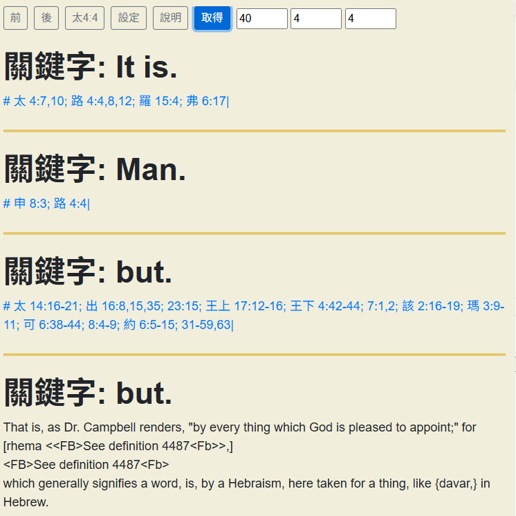
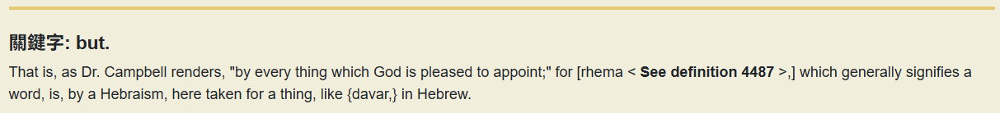

於 40:4:4

Input 為

"\n * It is.\n # 7,10; Lu 4:4,8,12; Ro 15:4; Eph 6:17|\n * Man.\n # De 8:3; Lu 4:4|\n * but.\n # 14:16-21; Ex 16:8,15,35; 23:15; 1Ki 17:12-16; 2Ki 4:42-44; 7:1,2|\n # Hag 2:16-19; Mal 3:9-11; Mr 6:38-44; 8:4-9; Joh 6:5-15; 31-59,63|\n * but.\n   That is, as Dr. Campbell renders, \"by every thing which God is\n   pleased to appoint;\" for [rhema <<FB>See definition 4487<Fb>>,]\n   which generally signifies a word, is, by a Hebraism, here\n   taken for a thing, like {davar,} in Hebrew.\n\n"

要修改，parseTsk 的最後一個關鍵字的結果，即下面所描述「原本的」樣子。

  {
    "type": "keyword",
    "keyword": "but.",
    "items": [
      {
        "type": "text",
        "w": "That is, as Dr. Campbell renders, \"by every thing which God is pleased to appoint;\" for"
      },
      {
        "type": "orig",
        "w": "[rhema <<FB>See definition 4487<Fb>>,]"
      },
      {
        "type": "fb",
        "w": "<FB>See definition 4487<Fb>"
      },
      {
        "type": "text",
        "w": "which generally signifies a word, is, by a Hebraism, here taken for a thing, like {davar,} in Hebrew."
      }
    ]
  }


我希望它的 items 是

```js

jaItems = [
    {
        type: "text",
        w: "That is, as Dr. Campbell renders, \"by every thing which God is pleased to appoint;\" for [rhema "
    },{
        type: "text-fb",
        w: "See definition 4487"
    },{
        type: "text",
        w: ",] which generally signifies a word, is, by a Hebraism, here taken for a thing, like {davar,} in Hebrew."
    }
]
```

也就是說，我不再需要把 \[ \] 這類偵測出來，將其視為一般文字，並且 \<FB> \<Fb> 其實是粗體的標記, 之後在 render 的時候，則是 span 的方式呈現。

按上述說明，update parseTsk 的部分。


50:5:22

1:1:20

# 結果



