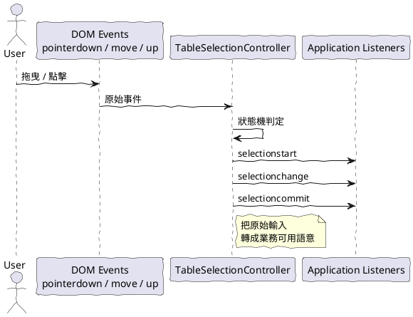
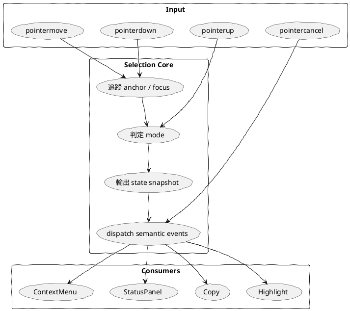

# TableSelection 01 核心概念與心智模型

這一組文件的目的，不是先寫程式，而是先回答一個問題：

為什麼 table 選取功能，值得被做成一個獨立工具？

答案是：它不是單一事件處理，而是一個有狀態、有邊界、有輸出的互動系統。

如果把它只看成 mousedown、mousemove、mouseup 三個事件，很快就會把下列責任全部塞進同一支檔案：

- 滑鼠與 touch 的差異
- 起點與終點的記錄
- 單格、同欄、跨欄模式判定
- highlight 呈現
- copy 輸出
- context menu 開啟時機
- table 被重建或刪除時的清理

一開始可以運作，但之後每加一個需求，都會往同一團邏輯堆疊。

因此，比較好的看法是：

TableSelection 不是事件集合，而是一個選取控制器。

## 一、它在系統中的角色

它的工作是把低階 DOM 事件，轉成高階選取語意。

也就是說，使用端不需要知道使用者怎麼拖曳，只需要知道：

- 選取開始了
- 選取範圍改變了
- 選取完成了
- 選取取消了

## 二、它不是哪幾個東西

它不是：

- 不是 copy 工具
- 不是 context menu 工具
- 不是 status panel 工具
- 不是 table renderer

它可以支援這些功能，但不應直接綁死這些功能。

因為這些都是「選取之後要做什麼」，不是「如何判定選取」。

## 三、你應該怎麼想它

建議把它想成一個可重複使用的中介層：

這樣的好處是：

- 控制器可以重複用在不同 table
- 使用端可以各自擴充，不互相污染
- 規格能被文件化
- 後續比較容易測試

## 四、最重要的建模決定

在設計上，應先決定三件事：

1. 核心狀態存在 class instance 內，不放全域
2. 對外輸出語意化事件，不直接暴露 DOM 細節
3. highlight、copy、menu 都是 listener，不塞回控制器本體

## 五、這組文件的閱讀順序

1. 先看本篇，建立整體心智模型
2. 再看 02，釐清哪些責任該放哪裡
3. 再看 03，理解狀態機本身怎麼運作
4. 再看 04，理解事件契約怎麼設計
5. 再看 05，理解初始化、解構、table 被刪除怎麼處理
6. 最後看 06，把前面概念落到實作骨架

## 六、一句話總結

TableSelection 工具的價值，不在於幫你綁事件，而在於幫你把選取互動定義成一個穩定、可重用、可擴充的語意層。