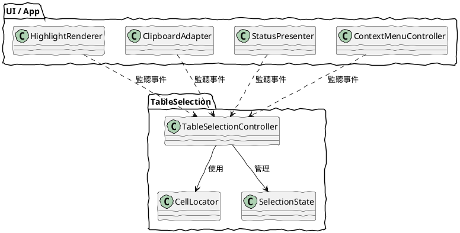
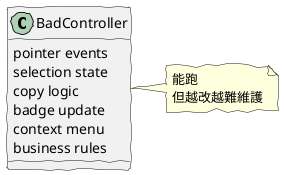
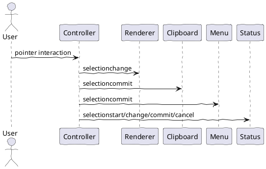

# TableSelection 02 責任切分與解耦邊界

這篇處理一件最容易做錯的事：

哪些東西應該放進 TableSelectionController，哪些不應該。

## 一、核心原則

控制器只處理「選取行為本身」，不處理「選取完成後的應用行為」。

## 二、推薦的責任分層

## 三、哪些責任應該放在控制器內

應放進控制器的：

- pointerdown、pointermove、pointerup、pointercancel 的整合
- anchor cell / focus cell 的追蹤
- row、col 的定位
- single、col、row 模式判定
- 對外送出 selectionstart、selectionchange、selectioncommit、selectioncancel
- 維護本次選取的 state snapshot
- 初始化與解構
- table 已從 DOM 移除時的清理策略

## 四、哪些責任不應該放在控制器內

不應放進控制器的：

- copy 成 text/plain 還是 text/html
- status panel 顯示什麼字
- context menu 何時彈出
- 某些模式能不能複製
- 右鍵功能表有哪些項目
- highlight 要用 class、overlay、還是 canvas

這些都屬於應用層政策。

## 五、常見錯誤做法

### 1. 把所有 UI 都塞回控制器

問題：

- 測試困難
- 重用困難
- 規則互相糾纏
- 一個 UI 改動會碰到整個核心

### 2. 用全域 state 管多個 table

這會導致：

- 無法同頁多實例
- table 重建後容易殘留舊參考
- document 事件與舊 table 混線
- destroy 不完整時很難追

## 六、推薦的資料流

這樣一來，每個模組只知道自己該知道的事。

## 七、你提到的需求，應怎麼分配

你提出的需求如下：

- 初始化，指定一個 table
- 解構，若 table 從 html 被刪除
- click 事件，得到目前 row、col
- mousemove 事件，得到目前 row、col 與 start row、col
- mouseup 事件
- 有一個狀態物件記錄 start / end / status

推薦分配如下：

### 控制器負責

- init(table)
- destroy()
- 自動監測 disconnected
- 追蹤 anchor/focus/range/phase
- 對外發事件與 state snapshot

### listener 負責

- 顯示目前 row、col
- 顯示拖曳資訊
- mouseup 後決定 copy 或 menu

### state 設計方式

不要直接只存 row_start、col_start、row_end、col_end、status。

更好的做法是：

- anchorRow
- anchorCol
- focusRow
- focusCol
- phase
- mode

而 start/end 是 normalize 後的衍生資料。

## 八、簡化後的邊界判斷法

如果某段程式回答的是這些問題，它應該在控制器內：

- 現在有沒有正在選取？
- 起點在哪？
- 目前游標落在哪格？
- 現在屬於 single、col、還是 row？
- 這次選取何時完成或取消？

如果回答的是這些問題，它應該在控制器外：

- 選到之後畫什麼樣子？
- 選到之後顯示什麼文字？
- 選到之後複製什麼格式？
- 選到之後要不要開 menu？

## 九、一句話總結

控制器管理選取事實，listener 決定選取後果。這就是解耦邊界。