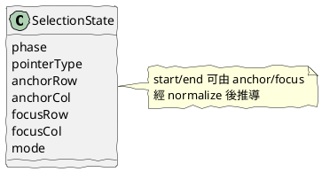
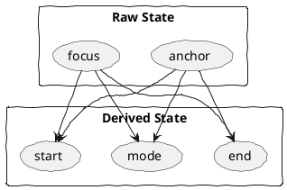
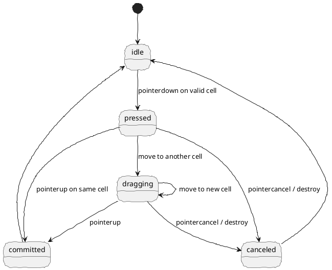

# TableSelection 03 狀態機設計

這篇講最核心的部分：

TableSelectionController 本質上是一個狀態機。

如果狀態建模清楚，事件自然就乾淨；如果狀態混亂，後面 copy、highlight、menu 都會開始長歪。

## 一、不要直接拿 DOM event 名稱當狀態

不建議把狀態定義成：

- down
- move
- up

因為那只是瀏覽器送進來的事件型別，不是你的業務狀態。

比較好的業務狀態是：

- idle
- pressed
- dragging
- committed
- canceled

實務上，instance 內甚至可以只保留：

- idle
- selecting

但對外輸出的事件仍然分成 start、change、commit、cancel。

## 二、核心狀態欄位

推薦的內部狀態：



### 建議欄位說明

| 欄位 | 意義 |
|------|------|
| phase | 目前互動階段 |
| pointerType | mouse / touch / pen |
| anchorRow / anchorCol | 起始格 |
| focusRow / focusCol | 目前游標所在格 |
| mode | single / crossed |

## 三、為什麼 anchor / focus 比 start / end 更重要

start / end 比較像結果，anchor / focus 才是互動過程中的事實。

例如使用者從右下往左上拖：

- anchor 是最初按下去的位置
- focus 是目前停留的位置
- start / end 則要經過 normalize 才能得到穩定的範圍



## 四、推薦的狀態轉移



這個模型有幾個優點：

- 拖曳未跨格時，仍可保留原生單格文字選取
- 一旦跨格，就切換成 controller 接管模式，停止原生文字選取
- 若拖曳又回到同一格，則還原為 single 狀態與單格選取
- cancel 與 destroy 有明確落點

## 五、mode 的判定規則

推薦規則：

- anchor 與 focus 完全相同：single
- 其餘所有跨格情況：crossed

如果未來還需要區分「同欄跨列」與「矩形跨欄」，建議新增另一個語意欄位，例如 `selectionKind`，而不是把 `mode` 再擴回三態。

## 六、state snapshot 應該長怎樣

對外可以提供一份 snapshot：

```text
{
  phase,
  pointerType,
  mode,
  anchorRow, anchorCol,
  focusRow,  focusCol,
  startRow,  startCol,
  endRow,    endCol
}
```

其中：

- anchor / focus 是原始事實
- start / end 是 normalized 結果
- mode 是語意判定

## 七、狀態機的實作分層建議

狀態機內可以切成三個小區塊：

1. 輸入解析
把 pointer event 轉成 cell 與座標

2. 狀態更新
更新 anchor、focus、phase、mode

3. 事件發送
根據狀態變化 dispatch 對應事件

## 八、一句話總結

不要把選取看成事件串，而要看成 anchor 與 focus 驅動的狀態機。這會讓整個工具穩很多。