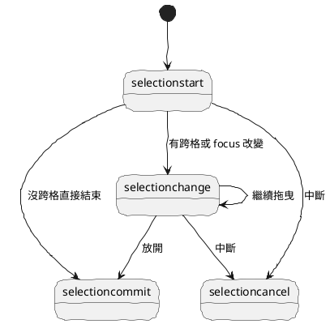
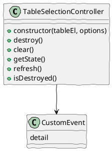

# TableSelection 04 事件契約與對外 API

這篇要回答的是：

如果把 TableSelection 做成一個工具，外界應該怎麼跟它互動？

結論是：

對外以語意化事件為主，以 state snapshot 與少量 public method 為輔。

## 一、推薦事件列表

### 1. cellclick

只在沒有形成拖曳時觸發。

適合：

- 顯示目前 row / col
- 單格操作
- 開啟細節資訊

### 2. selectionstart

起點命中有效 cell 時觸發。

適合：

- 清空舊 UI
- 重置狀態面板

### 3. selectionchange

只有當 focus cell 真的改變時觸發。

適合：

- 更新 highlight
- 更新拖曳中的狀態文字

### 4. selectioncommit

本次選取完成時觸發。

適合：

- copy
- context menu
- 寫入外部 state
- 最終統計顯示

### 5. selectioncancel

選取被取消或中斷時觸發。

適合：

- 清除 highlight
- 關閉暫態 UI

## 二、事件流建議

## 三、detail 應該提供什麼

推薦所有選取相關事件都帶一致格式的 detail，至少包含：

| 欄位 | 說明 |
|------|------|
| row / col | 目前 focus cell |
| anchorRow / anchorCol | 起點 |
| focusRow / focusCol | 目前位置 |
| startRow / startCol | normalize 後起點 |
| endRow / endCol | normalize 後終點 |
| phase | 互動階段 |
| mode | single / crossed |
| pointerType | mouse / touch / pen |
| nativeEvent | 原始事件參考 |

其中 cellclick 可簡化，但仍建議沿用同一套 naming。

補充規則：

- `mode = single` 代表目前選取仍停留在同一個 cell
- `mode = crossed` 代表本次拖曳已跨出起始 cell，後續由 controller 接管多格選取
- 若 crossed 後又回到同一個 cell，`mode` 會回到 `single`

## 四、為什麼不直接把 DOM td 傳出去

可以傳，但不該只傳 DOM。

原因：

- listener 會依賴目前 DOM 結構
- table 重建後舊 ref 可能失效
- rowspan / colspan 或 data-r / data-c 會讓 DOM index 不穩定

較好的做法是：

- detail 以 row / col 為主
- 需要時可附 cell，但不把 cell 當唯一真相

## 五、public methods 建議

推薦只暴露少量方法：

- destroy()
- clear()
- getState()
- refresh()
- isDestroyed()

### destroy()

解除所有事件、observer、暫存引用。

### clear()

清除目前選取與 highlight 狀態。

### getState()

回傳目前 snapshot，不讓外界直接改內部狀態。

### refresh()

當 table 結構重排但 DOM 節點未換掉時，可要求重新計算必要快取。

### isDestroyed()

協助外部避免對已銷毀 instance 操作。

## 六、推薦的 class 外觀

## 七、事件命名上的建議

不要輸出太貼近瀏覽器的事件名，例如：

- ondown
- onmove
- onup

比較好的命名是語意導向：

- cellclick
- selectionstart
- selectionchange
- selectioncommit
- selectioncancel

這樣使用端不需要理解你的內部時序，也比較容易長期演進。

## 八、一句話總結

好的 API 不只是讓外部拿到資料，而是讓外部只拿到它真正需要的資料。