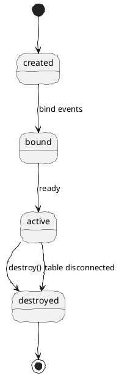
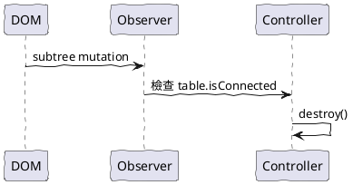
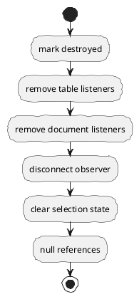

# TableSelection 05 生命週期：初始化、解構、自動清理

這篇處理一個很實務的問題：

table 不是永遠存在。它可能被重建、被 replace、被 remove，甚至整塊頁面被重新 render。

因此，TableSelection 工具若只有 constructor，沒有生命週期設計，後面一定會留下殘影。

## 一、推薦生命週期

## 二、初始化時應做的事

constructor(tableEl, options) 建議只做這些：

- 驗證 tableEl 是否有效
- 建立初始 state
- 綁定事件
- 視需要啟動 MutationObserver
- 設定 destroyed = false

不建議在 constructor 直接做：

- copy 綁定
- status panel 綁定
- context menu 綁定
- 業務規則注入

## 三、destroy() 必須保證什麼

destroy() 至少應保證：

- table 上的事件被解除
- document 上的事件被解除
- MutationObserver 被 disconnect
- 內部對 table 的引用被清空
- 目前狀態改為 destroyed
- 後續重複呼叫 destroy() 不報錯

也就是 destroy() 要具備冪等性。

## 四、為什麼要處理 table 從 HTML 被刪除

因為你現在的需求明確提到：

若此 table 從 html 被刪除，要能解構。

這代表工具不能假設外部一定會手動呼叫 destroy()。

因此建議支援：

- 手動 destroy()
- 自動 auto destroy

## 五、自動清理策略

推薦用 MutationObserver 監測 table 是否仍連接在 document 中。

### 推薦 option

- autoDestroyWhenDisconnected: true

這樣可由使用端決定要不要啟用。

## 六、重建 table 的兩種情況

### 1. 整個 table DOM 節點被換掉

這時舊 instance 應 destroy，新 table 建立新 instance。

### 2. table DOM 還在，但 tbody 被重畫

這時可能只需要 refresh()，重算快取與狀態。

所以 refresh() 的存在是合理的，但責任應維持很小。

## 七、推薦的清理順序

先標記 destroyed，可以避免清理過程中又有異步事件衝進來。

## 八、和 document 事件的關係

因為 move / up 往往綁在 document，所以如果不清乾淨，最容易留下這些問題：

- 已刪除的 table instance 還在收事件
- 新舊 instance 同時反應
- 滑鼠一動就觸發多份邏輯

這是生命週期一定要設計好的原因。

## 九、一句話總結

一個能重用的 TableSelection 工具，不只要會開始工作，還要會安全地結束工作。