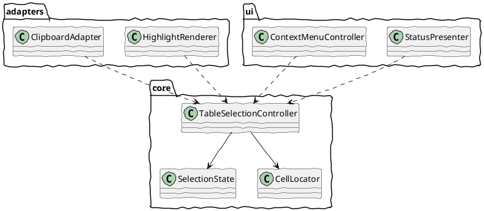
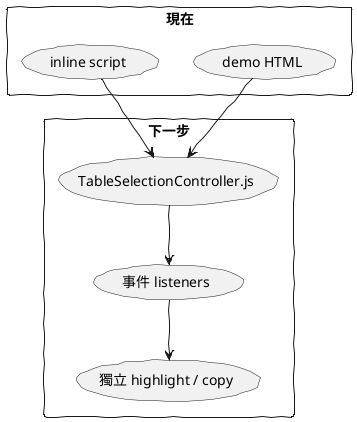

# TableSelection 06 落地骨架與協作範本

前面五篇已經把觀念講完，這一篇把它收斂成可實作的骨架。

目標不是提供最終版程式，而是提供一個穩定的落地結構。

## 一、推薦模組結構



## 二、最小可用 class 骨架

```js
export class TableSelectionController extends EventTarget {
  #table;
  #state;
  #destroyed = false;
  #observer = null;

  constructor(tableEl, options = {}) {
    super();
    this.#table = tableEl;
    this.#state = this.#createInitialState();
    this.#bindEvents();
    if (options.autoDestroyWhenDisconnected) {
      this.#observeDisconnect();
    }
  }

  destroy() {}
  clear() {}
  refresh() {}
  getState() {}
  isDestroyed() {}
}
```

## 三、建議的 state 形狀

```js
{
  phase: 'idle',
  pointerType: null,
  anchorRow: null,
  anchorCol: null,
  focusRow: null,
  focusCol: null,
  mode: null
}
```

對外的 getState() 再補上 normalize 後的 start / end。

## 四、建議的事件使用方式

```plantuml
@startuml
skinparam handwritten true

participant App
participant Selector
participant Status
participant Copy
participant Menu

App -> Selector : new TableSelectionController(table)
Status ..> Selector : listen selectionstart/change/commit
Copy ..> Selector : listen selectioncommit
Menu ..> Selector : listen selectioncommit

@enduml
```

對外使用時，推薦像這樣：

```js
const selector = new TableSelectionController(table, {
  autoDestroyWhenDisconnected: true
});

selector.addEventListener('cellclick', ({ detail }) => {
  console.log(detail.row, detail.col);
});

selector.addEventListener('selectionchange', ({ detail }) => {
  updateStatus(detail);
  renderSelection(detail);
});

selector.addEventListener('selectioncommit', ({ detail }) => {
  maybeOpenMenu(detail);
  maybeCopy(detail);
});
```

## 五、和你目前需求的一一對應

| 需求 | 建議落點 |
|------|----------|
| 初始化指定 table | constructor(tableEl) |
| table 被刪除時解構 | MutationObserver + destroy() |
| click 得到 row col | cellclick |
| mousemove 得到目前與起點 row col | selectionchange |
| mouseup 結束 | selectioncommit |
| 全域狀態物件 | 改為 instance private state |

## 六、從目前 demo 走向工具化的過程



也就是：

1. 先把選取狀態機抽出成 class
2. 再把 copy、status、menu 逐步移到 listener
3. 最後讓工具本體只留下可重用核心

## 七、這份設計和 repo 既有方向的一致性

這個方向與 repo 內既有的 TableSelector 設計是一致的：

- 以 EventTarget 輸出語意事件
- listener 決定 UI 政策
- payload 以 row / col 為主

也就是說，這不是另起爐灶，而是把既有想法整理成一套更完整、更可維護的工具規格。

## 八、一句話總結

真正可用的工具，不是把 demo 包成 class，而是把責任邊界、狀態機、事件契約、生命週期一起定義清楚。