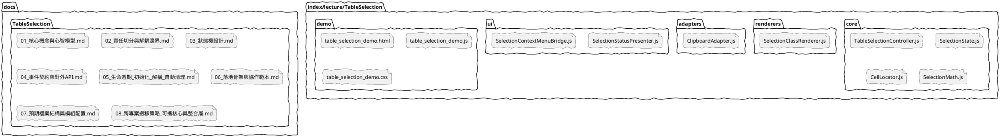
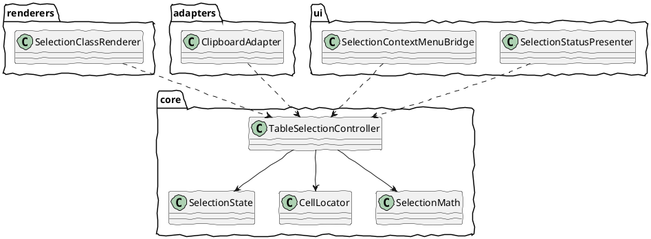
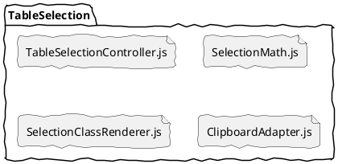

# TableSelection 07 預期檔案結構與模組配置

前面六篇談的是概念、責任、狀態機、事件、生命週期。

這一篇回答最後一個很實際的問題：

如果真的要把 TableSelection 做成一個像樣的工具，理想的檔案結構應該長什麼樣子？

重點不是檔案越多越好，而是讓每個檔案的責任穩定，之後擴充時不需要一直改核心。

## 一、理想目標

理想狀態下，TableSelection 應該形成一個小型子系統，而不是一支巨大的 JS。

也就是說：

- core 負責選取邏輯
- adapters 負責把選取結果轉成其他用途
- ui 負責畫面反應
- docs 負責規格與設計理由

## 二、推薦的目錄結構



這不是唯一答案，但它是一個責任相對清楚、可逐步落地的答案。

如果你接下來關心的不是「怎麼拆」，而是「哪些檔案未來搬去別的專案還能直接用」，請接著看第 08 篇。

## 三、為什麼要拆成這幾層

### 1. core

這層是工具真正的主體。

它應該盡量不碰具體 UI 政策，只處理：

- 狀態機
- row / col 定位
- mode 判定
- 事件發送
- 生命週期

### 2. renderers

這層只管「如何畫出選取效果」。

例如：

- 加 td class
- 清除舊 highlight
- 未來若改用 overlay，也只改這層

### 3. adapters

這層負責把 selection 結果轉成其他格式。

例如：

- 轉成 text/plain
- 轉成 text/html
- 轉成你自己的 cell 陣列格式

### 4. ui

這層處理產品層的 UI 反應。

例如：

- badge 顯示
- status 文字
- context menu 的開關

### 5. demo

這層不是核心工具本身，而是驗證場。

它的工作是：

- 驗證 API 是否順手
- 驗證事件是否足夠
- 驗證互動是否正確

## 四、每個檔案理想上負責什麼

## TableSelectionController.js

這是入口檔，也是外部最主要接觸的 class。

它應該負責：

- constructor(tableEl, options)
- destroy()
- clear()
- getState()
- refresh()
- dispatch 語意事件

它不應該負責：

- copy 細節
- panel 文字
- menu 規則

## SelectionState.js

這個檔案的價值在於把 state 模型獨立出來，避免 controller 裡面充滿散落欄位。

它可以負責：

- 初始 state 建立
- state reset
- snapshot 生成

如果未來發現這層太薄，也可以再合回 controller；但在設計上先切開，會比較容易想清楚。

## CellLocator.js

專門處理座標與 cell 對應。

它可以負責：

- 由 clientX / clientY 找到 td
- 由 td 取出 row / col
- 優先使用 data-r / data-c
- 回退到 rowIndex / cellIndex

這個檔案很關鍵，因為之後若遇到 rowspan / colspan，通常先壞的是定位，而不是狀態機。

## SelectionMath.js

這個檔案負責純計算，不碰 DOM。

它可以負責：

- normalize anchor / focus 成 start / end
- 判定 mode
- 判斷是否 collapsed
- 算出矩形或欄向範圍

這樣的好處是測試最容易寫，也最容易在腦中驗證正確性。

## SelectionClassRenderer.js

這個 renderer 是最基本的一版：

- 對被選的 td 加 class
- 清除舊 class
- 依 mode 套不同 class

未來如果改成 overlay，不需要動 controller。

## ClipboardAdapter.js

這個檔案負責：

- 接收 selectioncommit detail
- 從 table 或 cell 集合整理資料
- 輸出 text/plain 或 text/html

也就是說，copy 是 adapter，不是 controller 的內建行為。

## SelectionStatusPresenter.js

這個檔案負責：

- 監聽 selectionstart / change / commit / cancel
- 更新 mode badge
- 更新狀態文字

這是很典型的 listener 層。

## SelectionContextMenuBridge.js

它的名字刻意不叫 ContextMenuController，而叫 Bridge。

原因是它不該自己實作 menu，只是把 selection 事件橋接到現有 menu 機制。

它應該負責：

- 決定何時開 menu
- 將座標與選取資訊傳給 menu

## 五、推薦的依賴方向

理想的依賴方向應該單向流動：



注意這裡的方向：

- core 不依賴 ui
- core 不依賴 adapters
- core 不依賴 demo

這是整個工具能長期維護的關鍵。

## 六、和目前 repo 狀態的銜接方式

你目前 repo 已經有幾個接近的元件：

- 09 / 10 版的 TableSelector
- 各版 demo 的 copy / status / context menu listener

所以最合理的演進方式不是一次重寫，而是逐步搬遷：

1. 先把核心 selector 穩定成一個正式入口檔
2. 再把定位與計算抽成 helper
3. 再把 UI listener 整理成 bridge / presenter
4. 最後把 demo 改成只做組裝

## 七、如果想再更簡化，最小落地版本可只有哪些檔案

如果你覺得一開始就拆這麼多檔案太重，可以先從最小四檔開始：



也就是：

- 先有 controller
- 把純計算抽出去
- 把畫面與 copy 各拆一個檔

等需求更多，再把 CellLocator、StatusPresenter、ContextMenuBridge 切開。

## 八、理想狀態下 demo 檔案該長怎樣

理想的 demo 主程式，應該很薄：

```js
import { TableSelectionController } from './core/TableSelectionController.js';
import { SelectionClassRenderer } from './renderers/SelectionClassRenderer.js';
import { ClipboardAdapter } from './adapters/ClipboardAdapter.js';
import { SelectionStatusPresenter } from './ui/SelectionStatusPresenter.js';

const selector = new TableSelectionController(tableEl, {
  autoDestroyWhenDisconnected: true
});

new SelectionClassRenderer(selector, tableEl);
new ClipboardAdapter(selector, tableEl);
new SelectionStatusPresenter(selector, panelEl);
```

看到這段時，你應該有一個感覺：

demo 只是組裝，不再承擔核心邏輯。

這就是理想檔案結構真正帶來的好處。

## 九、命名上的建議

如果你要把它正式放進 repo，建議命名盡量穩定，不要混用太多 selector / smart table / selection rect 這些歷史名稱。

比較一致的命名方式會是：

- TableSelectionController
- SelectionState
- SelectionMath
- SelectionClassRenderer
- ClipboardAdapter

也就是以 Selection 為主軸，以角色名稱做後綴。

## 十、一句話總結

理想的檔案結構，不是把程式切碎，而是讓核心、畫面、輸出、展示各自有清楚位置，之後改任何一層都不會把整套工具拖下水。