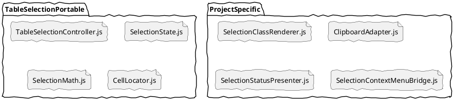
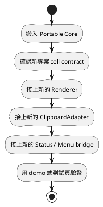

# TableSelection 08 跨專案搬移策略：可攜核心與整合層

前面第 07 篇談的是理想檔案結構，這一篇是在那個基礎上，再往前切出真正適合搬移的核心集合。

但如果真正考慮未來要搬到別的專案，還需要再多切一刀：

不是每個檔案都應該一起搬。

比較穩的做法是，把整套東西分成兩類：

- 可攜核心
- 專案整合層

這篇的目的，就是讓你未來搬移時，不用重新判斷哪些該帶、哪些該重寫。

## 一、核心判斷原則

判斷一個檔案能不能跨專案直接搬，最簡單的標準是：

它是否依賴「這個專案特有的 DOM 結構、CSS 命名、文案、資料格式、UI 政策」？

如果答案是否，通常可攜。

如果答案是，通常屬於整合層。

## 二、推薦切分

```plantuml
@startuml
skinparam handwritten true

package "Portable Core" {
  class TableSelectionController
  class SelectionState
  class CellLocator
  class SelectionMath
}

package "Project Integration" {
  class SelectionClassRenderer
  class ClipboardAdapter
  class SelectionStatusPresenter
  class SelectionContextMenuBridge
  class DemoAssembly
}

Portable Core <.. Project Integration : 依賴核心事件與 state

@enduml
```

## 三、哪些檔案屬於可攜核心

### TableSelectionController.js

這是最主要的可攜核心。

只要它：

- 不依賴專案特定全域變數
- 不依賴特定 UI 元件
- 不直接寫入某個 panel DOM
- 不直接做 copy 規則

那它就非常適合跨專案搬移。

### SelectionState.js

這是純模型層，通常完全可攜。

### SelectionMath.js

這是純計算層，也通常完全可攜。

### CellLocator.js

這個檔案原則上也可攜，但有一個條件：

它的定位規則不能寫死在某個專案 DOM 結構上。

例如，如果它假設一定是：

- tbody td
- data-r / data-c
- rowIndex / cellIndex

那它仍然可攜，但前提是新專案也接受這個 contract。

所以 CellLocator 是「條件式可攜」。

## 四、哪些檔案屬於專案整合層

### SelectionClassRenderer.js

這層通常會依賴：

- CSS class 名稱
- table 樣式規則
- 選取模式對應的視覺設計

因此它比較像「可重寫的小薄層」，不是核心。

### ClipboardAdapter.js

copy 幾乎一定有專案差異。

例如：

- 複製 plain text 還是 html
- 欄位間是否用 tab
- 是否要保留 innerHTML
- 是否要轉成某種資料格式

所以 ClipboardAdapter 不該假設可直接通用。

### SelectionStatusPresenter.js

這層高度依賴：

- 面板 DOM
- 顯示文案
- badge 樣式

它一定是整合層。

### SelectionContextMenuBridge.js

這層直接依賴專案的 menu 機制，更不可能是通用核心。

### demo

demo 當然不是可攜核心，它是驗證與展示層。

## 五、最推薦的搬移單位

真正推薦搬的，不是整個 TableSelection 資料夾，而是：



也就是：

- 核心可以搬
- 外圍在新專案重接

這樣成功率最高。

## 六、跨專案時需要重新確認的 contract

就算是可攜核心，搬移前也要重新確認幾件事。

### 1. cell 如何被定位

新專案是否也有：

- table
- tbody
- td
- data-r / data-c 或可替代規則

### 2. mode 定義是否一致

目前 mode 是：

- single
- col
- row

如果新專案需要的是矩形框選、自由框選、跨區塊選取，核心規則可能要擴充。

### 3. pointer event 是否可用

若新專案跑在特殊環境，Pointer Events 支援性要確認。

### 4. Selection API 是否符合需求

若新專案對原生文字選取與 copy 有不同要求，核心與 adapter 的邊界要再調整。

## 七、你現在這份規畫，搬移友善度如何

如果照目前文件方向落地，搬移友善度會是：

- core：高
- renderers：中
- adapters：中低
- ui：低
- demo：低

這不是缺點，這是正常分工。

真正的關鍵不是每一層都能搬，而是你很清楚哪些層該搬、哪些層該重接。

## 八、理想的搬移流程



不要先搬所有 UI，再來看核心能不能用。

正確順序是：

1. 先驗證核心事件與 state
2. 再逐步接上專案層

## 九、從 repo 內現況看，哪些部分已接近可攜

以目前已有的實作來看，[index/lecture/10_smart_table_joTable_demo/TableSelector.js](index/lecture/10_smart_table_joTable_demo/TableSelector.js) 已經很接近可攜核心，因為它：

- 沒有依賴 repo 內特定資料模組
- 主要使用瀏覽器原生 DOM API
- 對外用 EventTarget 發事件

但它還混著一部分 renderer 性質的責任，例如：

- 清除 td.sel
- 加上 cross-sel
- 加上 td.sel

這代表它雖然可搬，但還不是最乾淨的 portable core。

如果未來要真的做成可攜元件，建議把這段責任再抽離。

## 十、最後的實務建議

如果你的目標是「未來這套東西搬到別的專案也能快用」，那最實際的策略不是：

把整包資料夾搬過去。

而是：

先把 core 做成真正乾淨、低依賴的小集合；
外層 renderer、copy、status、menu 都視新專案重接。

這樣才是真的可攜。

## 十一、一句話總結

跨專案可用的，不會是整套畫面與行為，而是那個不依賴專案政策的核心選取引擎。

如果接下來要真正落地，下一步就不是再補概念，而是先把這裡提到的 Portable Core 做成實際檔案骨架。