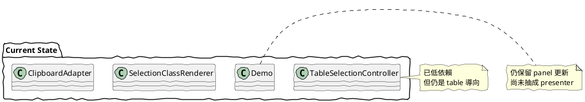

# TableSelection 09 目前骨架的取捨與下一步

前面 01 到 08 已經把概念、模組邊界、搬移策略講清楚。

這一篇專門面對目前已經落地的最小骨架，說明它現在有哪些刻意保留的取捨，以及下一輪應該怎麼收斂。

## 一、目前已落地的骨架

目前已經有這些實際檔案：

- core/TableSelectionController.js
- core/SelectionState.js
- core/SelectionMath.js
- core/CellLocator.js
- renderers/SelectionClassRenderer.js
- adapters/ClipboardAdapter.js
- demo/table_selection_demo.html

這代表整體方向已不再只是文件，而是已經有一條最小可執行路徑。

## 二、這一版刻意保留的取捨

### 1. controller 仍然只處理 table 型互動

這是刻意的。

目前沒有把核心抽象成任意 grid selector，因為那會過早擴張問題範圍。

### 2. renderer 與 adapter 先保持很薄

這也是刻意的。

這一版的目的，是驗證核心事件是否足以支撐第二層，不是一次把整套產品 UI 完成。

### 3. demo 仍保留少量整合碼

status panel 目前還留在 demo 主程式中，而不是再拆出 presenter。

這是因為要先驗證核心與第二層的邊界，而不是過早切太細。

## 三、目前仍存在的技術取捨

### 1. controller 仍假設目標是 table cell

這不是 bug，而是 contract。

目前 Portable Core 的可攜性，是建立在「另一個專案也接受 table / cell contract」之上。

### 2. renderer 自己重做了一份 cell 收集規則

這一版為了保持簡單，讓 renderer 直接依據 detail 去掃 table cells。

未來若 renderer、adapter、測試都需要同一份 cell 收集規則，應再抽出共享 helper。

### 3. ClipboardAdapter 仍是 document-level copy interception

這是合理的第一版，但未來可能要再加條件，例如：

- 只有當最近一次 selection 來自此 table 才攔截
- 或加 enable / disable 控制

### 4. single 模式仍主要依賴原生文字選取

這和最初 demo 的方向一致，優點是保留瀏覽器原生行為；缺點是各瀏覽器表現差異仍需要實測。

目前已補上一條更具體的實作決策：

- pointerdown 時記住起始 caret 邊界
- crossed 後若又回到同一個 cell，則以原始 caret 作為 anchor 重建 single 選取
- 還原時優先使用瀏覽器的 `Selection.setBaseAndExtent()`，退回方案才使用一般 range

這樣做的目的，是讓「跨 cell 後再回來」仍保有原本字元起點與拖曳方向，而不是退回整格選取。

### 5. `mode` 已收斂為 `single / crossed`

這次的設計選擇，是把 `mode` 從 `single / col / row` 收斂成 `single / crossed`。

原因是：

- 視覺層現在只需要知道有沒有跨 cell
- 原生文字選取的接管規則，也只取決於是否已跨 cell
- copy 的差異屬於 adapter 的輸出策略，不應污染 core 的 mode 契約

## 四、下一輪收斂建議

### 1. 抽出 shared cell collection helper

當 renderer 與 adapter 都在做「依 detail 找 cells」時，就值得抽一層共用邏輯。

### 2. 補上 presenter 層

讓 demo 不再直接處理 status panel，驗證第三層 UI bridge 的合理性。

### 3. 決定 single 模式是否要進一步規格化

目前 single 保留原生行為，未來要不要在 touch / desktop 做更一致的規格，需要產品面決定。

目前已明確增加一條規則：

- 一旦跨出起始 cell，就停止原生文字選取
- 若拖曳又回到同一 cell，才恢復 single 選取

另外還有一條對使用者體感很重要的補充：

- 恢復 single 時，不只是「回到同一格」而已，而是要回到原本的字元 anchor

### 4. 補最小測試頁或測試腳本

目前是 demo 驗證導向，之後若要把 core 當可攜元件，至少要補：

- mode 判定測試
- normalize range 測試
- disconnected destroy 測試

## 五、這一版的價值

這一版最重要的成果不是功能變多，而是確定了一件事：

文件中規畫的三層邊界，已經可以開始用實際檔案承載，而不是停留在概念。

也就是：

- 文件不是空想
- 核心不是黏在 demo 裡
- 第二層已經能接上

## 六、一句話總結

目前這個骨架不是終局，但它已經跨過最重要的一步：從概念解耦，走到可執行的模組解耦。