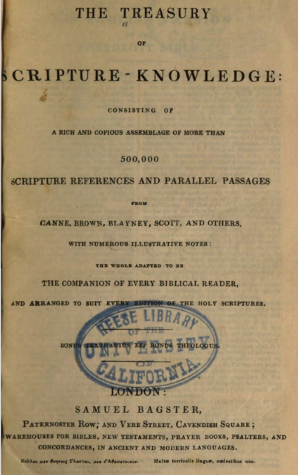
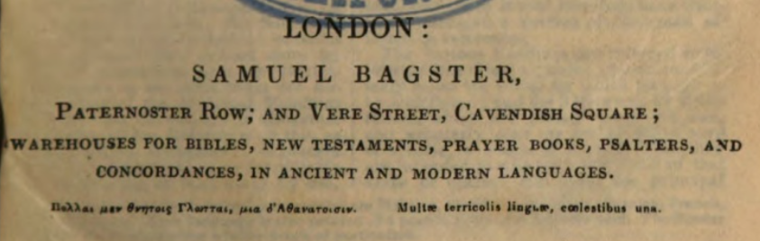
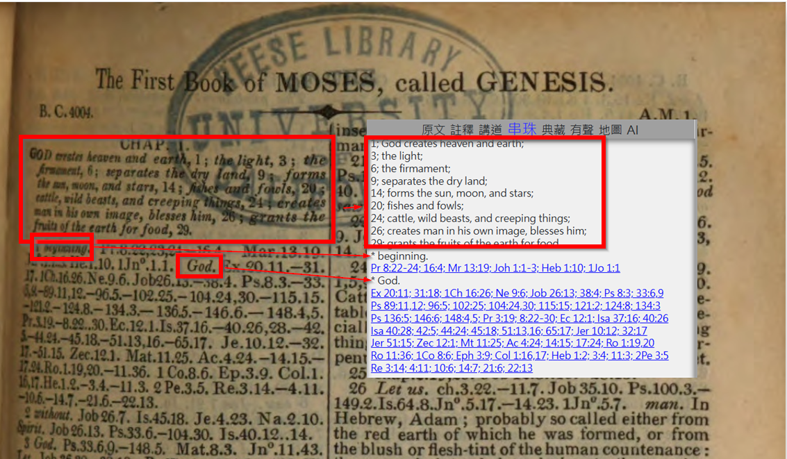
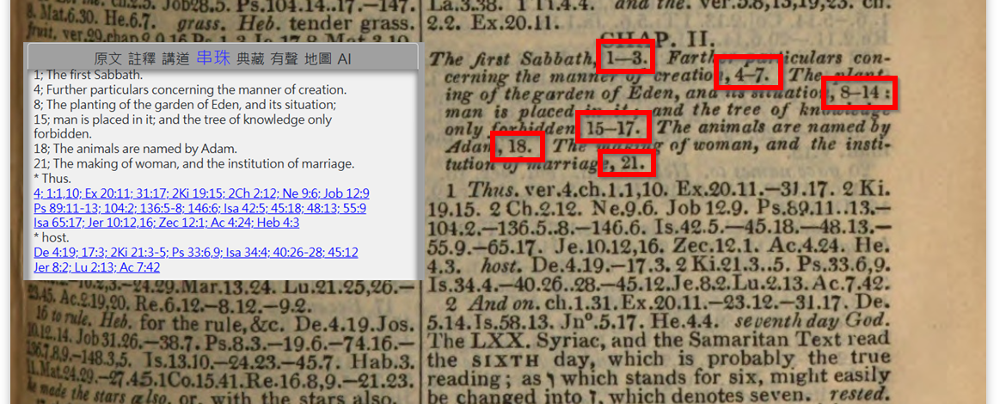

TSK 是一部歷史悠久的「聖經串珠」專著，最早於 1830 年左右在倫敦出版，由 Samuel Bagster 編輯。它與一般的聖經註釋書不同，它不提供人為的解釋，而是主張「以經解經」，創作者認為聖經本身就是最好的註釋。

---

### 書面

> https://babel.hathitrust.org/cgi/pt?id=uc1.$b247084&seq=7

---

### 編者(放大)

- Samuel Bagster
- LONDON

> https://babel.hathitrust.org/cgi/pt?id=uc1.$b247084&seq=7

---

### 譯本

- 這年代，與編者地點。
- 可以發現，它所用的英文是 KJV。(1611 年)
- KJV RF...Rf CM 標記
  - RF 是 KJV 的註腳，而 Rf 是這個註腳的結束點。
  - 你會發現 TSK 的內容，不只章的摘要、關鍵字的交互參照，也有會類似的註腳。如 創1:4。
  - And God called the light Day, and the darkness he called Night. And the evening and the morning were the first day. \<RF>And the evening...: Heb. And the evening was, and the morning was etc.\<Rf>\<CM>
  - 
### 內容

- 本章摘要
- 關鍵字 及 對應的 Cross-references (交互參照)
- 創1:1 為例

> https://babel.hathitrust.org/cgi/pt?id=uc1.$b247084&seq=25

---

- 摘要，書中可能是「單節」也可能是「段落」。
- 以「創2:1」為例(下圖)， 1-3, 4-7, 8-14, 15-17, 18, 21 有簡述一下摘要。而 API 只會寫 1, 4, 8, 15, 18, 21

> https://babel.hathitrust.org/cgi/pt?id=uc1.$b247084&seq=25

--- 

- 摘要, 只會在每章的第一節出現

---

### 其它網頁

- https://thetreasuryofscriptureknowledge.com/TSK/Genesis/1/5
- 它沒提供註腳
- 他有提供交互參照
- 它沒提供章的摘要