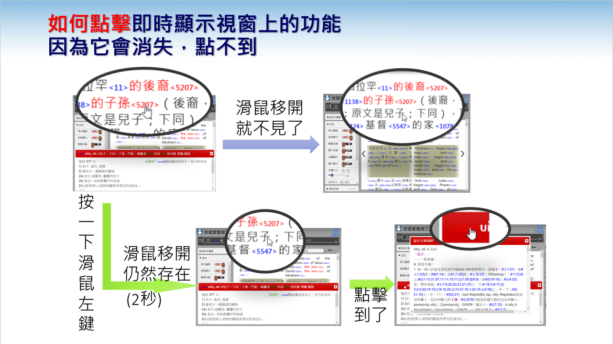

# 信望愛聖經工具 使用說明

線上版：<https://bible.fhl.net/NUI/>

這份說明依「想做什麼」來寫，不是照選單逐項介紹。每一節都可以單獨看，先找你有興趣的就好。

---

## 畫面長什麼樣子

畫面分成工具列和下面三欄：

- **工具列**：最左邊的「?」開啟這份說明；旁邊是開關左右面板的按鈕；中間「創世記：第三章 ▼」選書卷章；右邊是搜尋框
- **左側面板**：選譯本、設定、歷史記錄
- **中間**：經文。點某一節，那一節就成為「目前節」(底色會變)，右側面板的原文、串珠等跟著換成這一節
- **右側面板**：各種研讀資料，點上方的分頁切換
- 右側面板可以拖拉左邊框調整寬度

---

## 讀經

### 換書卷、章

- 點工具列中間的 **「創世記：第三章 ▼」** 選書卷和章
- 經文兩側的 **❮ ❯** 是上一章、下一章
- 在搜尋框直接打 `羅8:28` 也可以跳過去 (見下方〈查經文位置〉)

### 回到剛才讀的地方

左側 **歷史記錄** 會記下你讀過的位置 (記到「節」)。點一下就回去，而且會停在當時那一節，不用再往下捲。

瀏覽器的「上一頁」也有效。

### 分享目前的經文

網址會跟著你讀的位置變，例如 `https://bible.fhl.net/NUI/#/bible/約3:16`。直接複製網址給別人，對方打開就是同一節。

---

## 多譯本對照

### 選譯本

點左側 **聖經版本選擇** (或工具列上三欄的圖示)，可以勾選多個譯本同時顯示，例如和合本 + 新譯本 + KJV + 新約原文。

### 顯示方式

在 **設定 → 顯示切換** 選：

| 選項 | 適合 |
|------|------|
| 併排（單節） | 每節一列，各譯本左右並排，逐節比較最清楚 |
| 交錯（單節） | 每節底下依序列出各譯本，畫面窄 (手機) 時好讀 |
| 併排（段落） | 依段落分組並排，讀起來像一般聖經，比較不零碎 |
| 交錯（段落） | 依段落分組，譯本上下交錯 |

段落是以新譯本的分段為準。

---

## 原文：不懂希臘文、希伯來文也能用

### 什麼是 Strong Number (SN)

每個希臘文、希伯來文的字都有一個編號，例如「愛」(agapē) 是 G26。和合本、KJV 這類譯本在每個中文詞後面標上它對應的原文編號，所以即使不懂原文，也能知道「這裡的『愛』和那裡的『愛』是不是同一個原文字」。G 是希臘文 (新約)，H 是希伯來文 (舊約)。

### 顯示 SN

**設定 → 原文編號** 打開後，和合本、KJV、原文譯本會在字詞旁顯示 SN。

### 查一個字的意思

- **點 SN**：跳出原文字典，有字義、詞類、字源、在聖經中怎麼被翻譯。同時列出浸宣出版社與 CBOL 兩份字典
- **設定 → 即時SN** 打開後，滑鼠移到 SN 上就會在下方顯示簡短字義，不用點

字典裡常列出許多經文。和「正在讀的那一節」相同的經文會以**黃底**標出，並自動捲到那裡，方便看出這節被歸在哪個字義底下；沒有這一節、但有同一章的其它節時，會以**淡黃底＋虛線**標出。從搜尋結果點 SN 時，以那筆搜尋結果的經文為準。

即時顯示的視窗在滑鼠移開後就會消失，所以想點裡面的東西時，先在字上**按一下左鍵**，視窗會多停留 2 秒，這時就點得到了：

### 這個字在本章還出現在哪

滑鼠移到某個 SN 上：
- 本章**同一個原文字**會標成紅色
- **同源字** (字根相同的字，例如「愛」的名詞和動詞) 標成暗紅色 (新約)

這很適合看一段經文反覆出現的主題字。

### 看一節經文的原文分析

點一節經文後，右側選 **原文** 分頁：會列出這節每個原文字的原形、詞性、時態語態等文法分析 (Parsing)。動詞、連接詞、介系詞會上色，因為它們對理解句子結構最重要。

### 看整本聖經怎麼用這個字

在搜尋框打 SN，例如 `G26`，就會列出所有出現這個原文字的經文 (見下一節)。

---

## 搜尋

搜尋框在工具列右邊，打完按 **Enter** 或放大鏡。快速鍵 `Alt + Shift + F` 可以直接把游標移到搜尋框。

### 可以搜什麼

| 打什麼 | 例子 | 結果 |
|--------|------|------|
| 關鍵字 | `弟兄` | 所有含「弟兄」的經文 |
| SN | `G26`、`H430` | 所有用到這個原文字的經文 |
| 經文位置 | `羅1:3-4;約3:16` | 直接列出這幾段經文 |
| 希臘文 | `πνεῦμα` | 新約原文與七十士譯本，連變化形 (πνεύματος 等) 一起找 |
| 希伯來文 | `אלהים` | 舊約原文，可以不打母音；多個詞用空白分開 |

希臘文用一般鍵盤的重音就可以，不必特別挑字元。

### 搜尋範圍會自己挑

搜尋會依你**正在讀的書卷**決定先顯示哪裡：同一卷 → 同作者或同類 (例如保羅書信、約翰著作) → 同約 → 整本聖經。例如正在讀雅各書時搜「弟兄」，會直接顯示雅各書裡的結果。

結果視窗上方有分類與書卷按鈕 (括號內是節數)，點一下就能換範圍，正在讀的書卷會用紅框標出。

### 看搜尋結果

- 點結果中的經文位置，主畫面會跳過去，**搜尋視窗還留著**，可以一筆一筆點下去看上下文
- 搜尋視窗可以拖到旁邊，也可以在裡面直接再搜
- 每一筆右邊有複製按鈕，會複製「位置 + 經文」

---

## 以經解經：串珠與交互參照

### 串珠

右側 **串珠** 分頁：列出目前這節每個重點詞，在聖經其他地方的相關經文。資料來自 TSK (Treasury of Scripture Knowledge)，一部 1830 年代就出版、主張「以經解經」的串珠專著，不加人的解釋，只列經文。

**設定 → TSK顯示模式** 可選書卷名用英文、中文縮寫或中文全名。

### 點經文位置

註釋、串珠、字典裡出現的經文位置 (例如 `羅5:8`) 都可以點，有兩種看法：

- **方法 1**：跳出小視窗顯示那段經文，看完關掉，原本讀的地方不動
- **方法 2**：主畫面直接跳到那段經文

預設每次都會問。常用哪一種，可以在 **設定 → 交互參照方法** 固定下來。

---

## 其他研讀資料 (右側分頁)

| 分頁 | 內容 |
|------|------|
| 原文 | 目前這節的原文文法分析 (見上方) |
| 註釋 | 信望愛站的聖經註釋，依段落對應；也有書卷背景 |
| 講道 | 涵蓋這段經文的講道錄音 (例如康來昌牧師)，可調播放速度 |
| 串珠 | TSK 串珠 (見上方) |
| 典藏 | 歷代聖經、信仰著作、聖詩的掃描原件，例如 19 世紀的各地方言聖經 |
| 有聲 | 整章的有聲聖經，可以邊聽邊讀；依書卷有和合本、現代中文譯本、台語、客語、廣東話等 |
| 地圖 | 本章出現的地名標在地圖上 (例如 徒16 的腓立比、特羅亞)，可放大縮小 |
| 樹狀圖 | 以原文 SN 畫出的整章結構圖 (PDF，中英各一份)；只在讀羅馬書時出現這個分頁 |
| AI | 產生給 ChatGPT 等 AI 用的資料 (見下方) |

### 典藏

可以依分類 (聖經珍藏、信仰著作、聖詩珍藏…) 和語言篩選，例如在語言欄打「話」會找到台灣話、客家話等。有表格和卡片兩種看法，卡片會顯示簡介。

---

## 用 AI 研讀原文

右側 **AI** 分頁的按鈕會把目前經文的原文分析或各譯本內容，整理成 AI 容易讀的格式並**複製到剪貼簿**。你再貼到 ChatGPT 等 AI 工具，在前面加上自己的問題，例如：

> 依參考資料，分析句法結構，找出獨立句、關係子句、介系詞短語，並說明每句的功能

- **原文相關**：複製原文資料、結構分析、結構與對話
- **譯本比較相關**：譯本資料、對齊後比較、加入原文分析
- **多節**：可以一次產生好幾節 (旁邊的 🔧 設定節數，或依段落、整章)

每個按鈕旁的 ❓ 有範例問法。

---

## 設定

左側 **設定** 展開，設定會記在瀏覽器裡，下次打開還在。

| 設定 | 說明 |
|------|------|
| 原文編號 | 在字詞旁顯示 SN |
| 即時SN | 滑鼠移到 SN 上就顯示字典 |
| 繁簡切換 | 繁體 / 簡體 |
| 顯示切換 | 4 種對照方式 (見〈多譯本對照〉) |
| 字體大小 / H字 / G字 / SN字 | 分別調整中文、希伯來文、希臘文、SN 的字體大小 |
| 交互參照方法 | 點經文位置時用方法 1 或 2 (見〈以經解經〉) |
| 切換經文方法 | 選書卷章的視窗樣式；手機上不好點時可改「簡易」 |
| 註腳 | 點擊才顯示，或直接顯示 |
| TSK顯示模式 | 串珠的書卷名語言 |

---

## 快速鍵

| 按鍵 | 功能 |
|------|------|
| `Alt + Shift + F` | 游標移到搜尋框 |
| `Alt + Shift + Z` | 左側面板開關 |
| `Alt + Shift + C` | 右側面板開關 |
| `Alt + Shift + /` | 開啟這份說明 |

工具列最左邊的 **?** 也會開啟這份說明。

---

## 手機

畫面會依寬度調整。手機上建議：

- 用工具列上的視窗按鈕把左、右面板收起來，專心讀經文；需要時再打開
- 多譯本時用 **交錯** 模式比較好讀

---

## 問題回報

工具列右上角 **問題回報** 會開啟 email；也可以填 [回報表單](https://forms.gle/BmuPe2rmKKWgMUr5A)。

工具列左上角版本號旁的 **手動更新**，可以在網站更新後強制載入新版。
