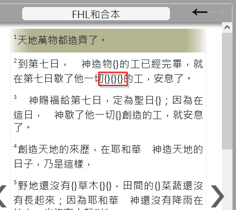
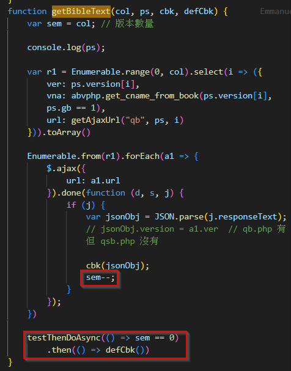
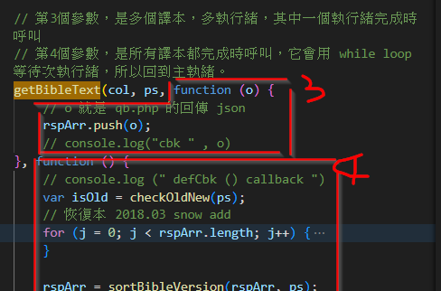

## 經文顯示 bug

### trace code



- qb.php 
- 有多處 qb ， 真正觸發的是 index.js 中的
- 多執行緒取得
    - 多執行緒呼叫 qb.php, 每 譯本完成, 會 sem--
    - 下面主執行緒有個等待 sem == 0



<div class='ig'>從呼叫，可看出， api 回傳，都存到 rspArr 中，流程從 4 callback 繼續處理 </div>

<span class='qa'>把資料 rspArr 變成顯示的部分在哪呢？</span>
以關鍵字 verseContent 就可以發現，就是在剛剛的下面而已。

但下面有 var mode = ps.show_mode;
switch ( mode ) 
<span class='qa'>這是什麼意思呢？</span>
==1 的時候，是併排顯示，是最多人用的模式
==2 的時候，是交錯模示。
==0 是原本程式，因為沒信心，所以沒拿掉原本的程式碼。

顯示流程
for i = 0 to maxRecordCnt-1 是每一節
for j = 0 to rspArr.length-1 是每一個版本

算出 var bibleText2 = addHebrewOrGreekCharClass(rspArr[j].version, bibleText)
<span class='qa'>這 bibleText2 的值是什麼，是內部處理不好嗎 </span>
- > 到第七\<WH07637>日\<WAH09002>\<WH03117>，　神\<WH0430>造\<WH06213>\<WTH8804>物{\<WAH0834>}的工\<WH04399>已經完畢\<WH03615>\<WTH8762>，就在第七\<WH07637>日\<WAH09002>\<WH03117>歇了他一切\<WAH04480>\<WAH03605>{\<WAH0834>}{\<WH06213>}{\<WTH8804>}的工\<WH04399>，安息了\<WH07673>\<WTH8799>。
- 這是結果，其實沒處理不好
- 處理這個的函式是 if (-1 != ["和合本", "KJV", "和合本2010"].indexOf(bibleVersion))，是 parseBibleText，是在 剛剛的 for i for j 迴圈中一開始
##

### 改

- 呼叫，將 .v_name 改成 .version
- 內部，將判斷式從 ["和合本","KJV","和合本2010"] 改成 ["unv","kjv","rcuv"]；下面的也順便改 "bhs" "fhlwh"
- 其它字串，除了有聲聖經，初始化 "和合本" 也改為 "FHL和合本"
- 從 v1.11.1 改為 v.1.12.1
- 記得改 gb 上傳到 gbdoc

```js
bibleText = parseBibleText(rec.bible_text, ps, isOld, rspArr[j].v_name);
// 不再使用 v_name 改使用 .version
```

<style>
    .markdown-body {
        font-size: 14pt ;
    }
    .markdown-body b {
        font-weight: 700;
    }
    img {
        max-height: 240px;
        border: 4px solid #ccc;
    }
    .ig {
        /* ig: image，圖示，因為要置中，所以用 div  */
        color: saddlebrown;
        /* border-left: 0px solid; */
        background-color: lightyellow;
        padding: 0.5em;
        line-height: 2em;
        margin-bottom: 1em;
        margin-top: 0em;
        text-align: center;
    }
    .qa {
        /* qa: question answer ， 引導式問題，有答案的問題 */
        color: darkgreen;
        border-left: 3px solid;
        background-color: lightgreen;
        padding: 0.5em;
        line-height: 4em;
    }
    blockquote {
        font-size: 14pt !important;
        color: darkorange !important;
    }
    .markdown-body code,
    code {
        color: #A0F !important;
        font-size: 1.50em !important;
        padding-top: 0em !important;
        padding-bottom: 0em !important;
    }
    .alert {
        padding: 15px;
        margin-bottom: 20px;
        text-align: left;
    }
    :root {
        --r-main-font-size: 14pt ;
    }
</style>