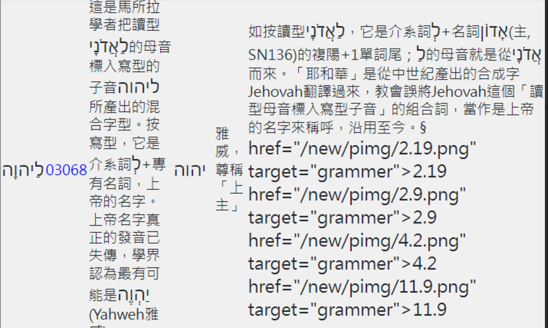

## tracing

- 士師記 11v30

- § 找這個字，會有 fhlInfoContent.js 與 index2.js，生效的是 fhlInfoContent.js
- 其實字串處理都沒錯，也就是 \[##\] 過程都是對的，應該是最後呼叫了 charHG 時，沒處理好。
- charHG 用途是將 注釋 中的原文，加上 class，才能控制大小。
- charHG 存在於 index2.js 與 index/charHG.js，要改第2個才會生效
- 主要是 charHG 判斷希伯來文時，還加入 ` ` 空白符號，不知道當時為何要加入。但我不修改 charHG

## 改

- 將 remark 處理流程，重構為 function do_remark()
- 將 port 若是 5500 , 也就是開發中，就會變成完整路徑
- 將 do_remark 與 charHG 呼叫順序修改，即可。
- 
