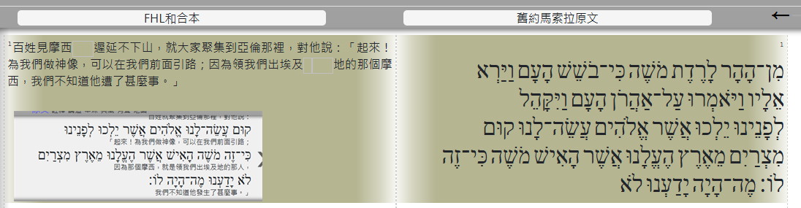
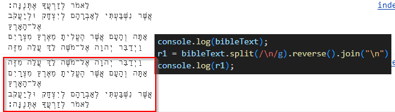
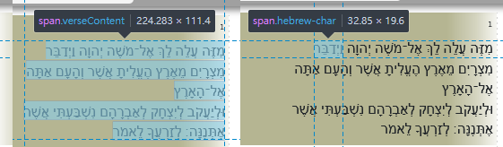

## Tracing


<div class='ig'>馬索拉原文的順序，很錯亂。Parsing的結果是對的，與 傳統的一致。</div>


<div class='ig'>從 qb.php 取出來的，原始資料是行的順序也是需要交換的 </div>


<div class='ig'> 每個字，是一個 span，整個，也是一個 span。</div>
.hebrew-char 有一個 inline-block ， 會使顯示錯誤，但很怪的是 parsing 那也是，卻不會。
.verseContent 沒有用途，之所以是靠右對齊，是 parent 的 div，具有的 hebrew-char-div ，這個 class 有 text-align: right; 所以可以靠右對齊。

但 inline-block 又是必須的，在 parsing 那，不然遇到 原文 + 3 單，會變為 3 + 原文 單。是錯的。

## 改

- 將 .css 的 .hebrew-char 的 display: inline-block; 抽離，並新增一個 .hebrew-char-inline-block。
- 承上，這個只在 Parsing 作即可。很簡單，將原本的 charHG 之後的 class 再加上 .hebrew-char-inline-block 即可。
- 承上，wform 與 remark 一樣，都要加上，因為也可能出現。

```js
remark = charHG (do_remark (remark) )
remark = charHebrew_Inline_Block(remark) 
```

####

<style>
    .markdown-body {
        font-size: 14pt ;
    }
    .markdown-body b {
        font-weight: 700;
    }
    img {
        max-height: 240px;
        border: 4px solid #ccc;
    }
    .ig {
        /* ig: image，圖示，因為要置中，所以用 div  */
        color: saddlebrown;
        /* border-left: 0px solid; */
        background-color: lightyellow;
        padding: 0.5em;
        line-height: 2em;
        margin-bottom: 1em;
        margin-top: 0em;
        text-align: center;
    }
    .qa {
        /* qa: question answer ， 引導式問題，有答案的問題 */
        color: darkgreen;
        border-left: 3px solid;
        background-color: lightgreen;
        padding: 0.5em;
        line-height: 4em;
    }
    blockquote {
        font-size: 14pt !important;
        color: darkorange !important;
    }
    .markdown-body code,
    code {
        color: #A0F !important;
        font-size: 1.50em !important;
        padding-top: 0em !important;
        padding-bottom: 0em !important;
    }
    .alert {
        padding: 15px;
        margin-bottom: 20px;
        text-align: left;
    }
    :root {
        --r-main-font-size: 14pt ;
    }
</style>