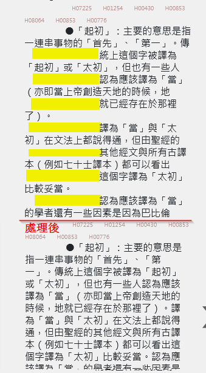

# 注釋換行空白處理

## trace_code

commentScrollDiv

- 真正影響的是 `fhlInfoContent.js` 而非 `index2.js`

- regex 不能直接用第2次，會失效，要用 lastIndex = 0 

## 改

- 新增一個 do_com_text 函數
- 若遇到 \r\n 符號，則把換行拿掉
- 通常，換行後，緊接著空白。
- 但是，若 \r\n空白空白空白 ... 之後，遇到 ◎ 符號，則要保留`換行與空白`
- 同樣邏輯，就是各種的「要保留的」。 capture group 2 的地方，除了最後一個 \S，若是最後一個，則只留字，就是 p2，其它都是留換行與空白，即 p1+p2。

## 結果比較

### style

