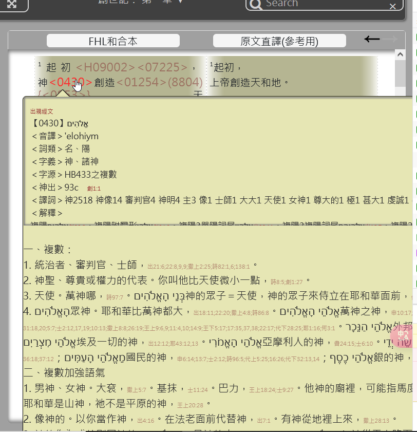
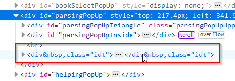
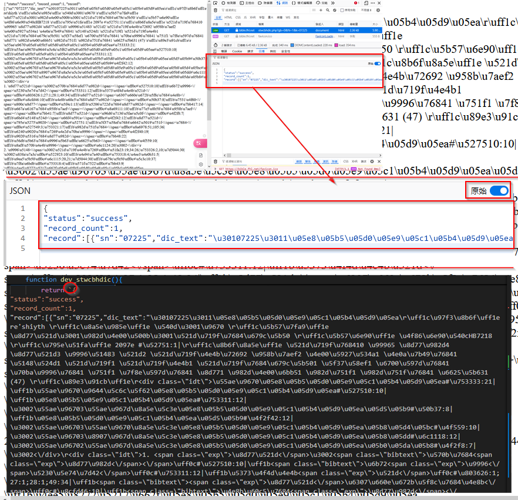
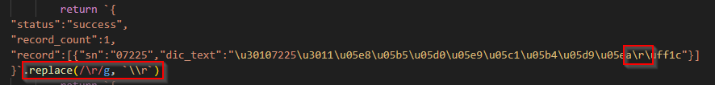
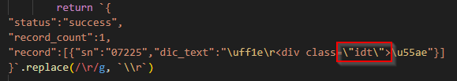
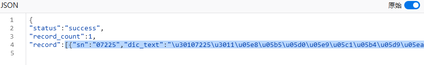
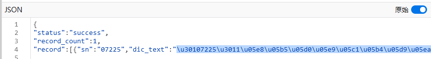
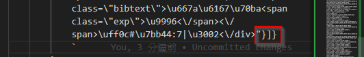
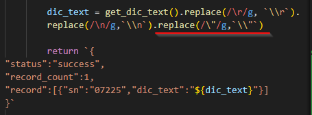

## survey

- parsingPopUp.js
    - `出現經文` 作為關鍵字，就能找到這個
    - `https://bible.fhl.net/json/sd.php?gb=0&N=1&k=01588` 是使用 sd api。
    - `https://bible.fhl.net/json/sbdag.php?N=0&k=3971&gb=0` 浸宣的 api 是這個
    - `https://bible.fhl.net/json/stwcbhdic.php?N=1&k=07225&gb=0` 舊約 api

- 太大
- 不是太大，只某些被轉壞掉了。


- 限定要在網路上開發
    - 用 gbdoc 吧





### 為了本地開發
- 因為浸宣的 api 不能本地取得。所以複製某個 api 作 開發用。

```javascript
console.log (dev_stwcbhdic())

jsonObj = JSON.parse( dev_stwcbhdic() )
console.log(jsonObj);
console.log(jsonObj.record[0].dic_text)
```


- 若遇到 \r，就會在 JSON.parse 時出現錯誤，所以要用 replace 成為 \\r 
- 這樣，在 log ( jo ) 時，雖然是會有 \r ， 但若 log jo.record[0] 時，是不會顯示 \r 而是正確表示


- 同樣，若是遇到 雙引號，如下圖。也會出現問題，要從  `\"idt\"` 改成 `\\"idt\\"` 。
- 但是，若用 replace(/\"/g, '\\"') 會將所有的雙引號都改成 \\\" ，這樣就會出現錯誤，因為 json 格式也是雙引號。









<style>
    body {
        font-size: 14pt ;
    }
    img {
        max-height: 240px;
        border: 4px solid #ccc;
        
    }
    .ig {
        /* ig: image，圖示，因為要置中，所以用 div  */
        color: saddlebrown;
        /* border-left: 0px solid; */
        background-color: lightyellow;
        padding: 0.5em;
        line-height: 2em;
        margin-bottom: 1em;
        margin-top: 0em;
        text-align: center;
    }
    .qa {
        /* qa: question answer ， 引導式問題，有答案的問題 */
        color: darkgreen;
        border-left: 3px solid;
        background-color: lightgreen;
        padding: 0.5em;
        line-height: 4em;
    }
    blockquote {
        font-size: 14pt !important;
        color: darkorange !important;
    }
    .markdown-body code,
    code {
        color: #A0F !important;
        font-size: 1.50em !important;
        padding-top: 0em !important;
        padding-bottom: 0em !important;
    }
    .alert {
        padding: 15px;
        margin-bottom: 20px;
        text-align: left;
    }
    :root {
        --r-main-font-size: 14pt ;
    }
</style>