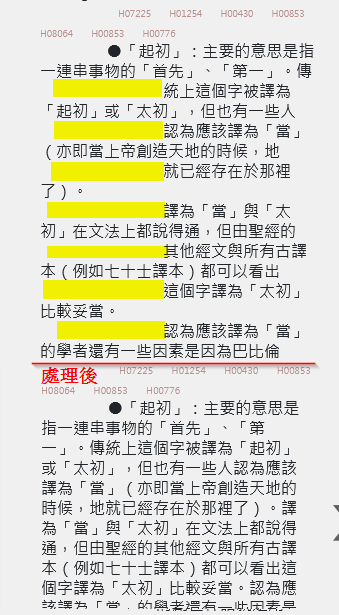
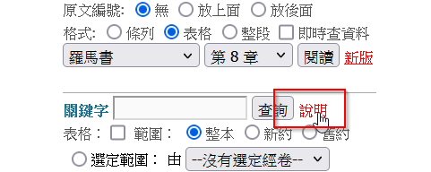

# 註釋相關說明_供工程師閱讀
# 目錄toc
[toc]

## 不分章節的完整註釋

- a2z
    - https://a2z.fhl.net/bible/
    - (不知道當時為何取 `a2z` 覺得挺有趣的，好像 `開始` 到 `結束` 的意思。因此很好記)
    - api 得到的資料，就是這些的局部


## sc_api

- `book` 參數
    - `sc.php` 其實不只是 `註釋` 資料而已，有個參數叫 `book=3` 是註釋，而 =4 就是 串珠這本書
- 實例
    - https://bible.fhl.net/json/sc.php?book=3&engs=Gen&chap=1&sec=1&gb=0
    - `註釋範圍`
    - 傳入 1 節，它會回傳 prev next ， 表示上一個注解，與下一個注解。
        - 例如 prev 是 {book:"3", engs:"Gen", chap: 0, sec: 0} ， next 是 {book:"3", engs:"Gen", chap: 1, sec: 3}
        - 由上可知， 包含 創1:1 ， 是 1:1-1:2 。
        - 承上，從 內容，也可以得到 範圍，不過是 `創世記 1章1節 到 1章2節` 方式顯示。
        - 承上，資料是 `record[0].title`
    - `內容`
    - `.record[0].com_text` 

## 注釋_背景

- 注意，當傳入 chap=0 sec=0，是此書卷的背景。

## 代號意義☆◎●☆

- 此部分在 `馬太福音` 背景裡有提到。

☆代號說明：
  「●」：經文註釋
  「◎」：個人感想與應用
  「○」：相關經文
  「☆」：特殊注意事項

## 注釋_內容_排版處理

- 原始資料換行，是 `\r\n`，將其以 `<br/>` 代替。
- 原始資料，縮排，是用 `space` 很多格。 
- 注釋資料，是由「空白」與「換行」組成的。這適用早期的 \<pre\> tag。但若直接顯示，就會很亂。如下圖上半部，是處理前。




[回到目錄](#目錄toc)

### 簡易處理法(NUI目前作法)

- 把換行與空白拿掉。
- 但是，若是 「●」 這些特殊的，或是「一」這種項目的要保留
- 參考核心程式碼

```javascript
function do_com_text(text){
    let reg_tp1 = /[零壹貳參肆伍陸柒捌玖拾]+、/g // 壹、
    let reg_tp2 = /[零一二三四五六七八九十百]+、/g // 一、
    let reg_tp3 = /（[零一二三四五六七八九十百]+）/g // （一）
    let reg_tp4 = /\d+\./g // 1.
    let reg_tp5 = /\(\d+\)/g // (1)
    let reg_tp6 = /[a-zA-Z]+\./g // a.
    let reg_tp7 = /[●◎⓪☆○※]/g
    let reg_tp8 = /\r?\n/g
    let reg_tp9 = /SNG|SNH/g // 創1:1
    

    // 組成字串, 以 | 分隔，為了製作組合的正規表達式
    let reg_tps = [reg_tp1, reg_tp2, reg_tp3, reg_tp4, reg_tp5, reg_tp6, reg_tp7, reg_tp8, reg_tp9]
    
    
    // 簡單實例 /\r?\n\s*(●|◎|a.|b.|c.|[零壹]、|\S)
    // 就是將上面的 用 `|` 組起來，最後加上 \S，前面加上 \r\n\s*
    let reg_pre = /\r?\n\s*/g
    let reg_tp_str = reg_tps.map(reg => reg.source).join("|")
    let reg_combile_str = "(" + reg_pre.source + ")" + "(" + reg_tp_str + "|\\S)"
    let reg_combile = new RegExp(reg_combile_str, "g")

    // 結果字串
    text_result = text.replace(reg_combile, (match, p1, p2) => {
        reg_tps.forEach(reg => reg.lastIndex = 0 ) // reset 正規化表達式，不然第2次會失效。
        if (reg_tps.some(reg => reg.test(p2))) {
            return p1 + p2
        } else {
            return p2
        }
    })

    return text_result + "\r\n\r\n\r\n" // 為了不要被遮到最下面
}
```

[回到目錄](#目錄toc)

### 複雜處理法(RWD處理作法)

- 忘的差不多了。
- 比起 NUI，它還計算了「項目」的前面空白有幾格，來判斷從屬關係，再配合使用「ol」與「ul」標籤。

## 注釋_特殊內容

### SNG_SNH

- 注釋內容，包含 Strong Number。[SN相關說明連結](https://hackmd.io/@EmmanuelLo/rkEar1zXkg)
- 馬太福音1:1，同時包含2種實例。
    - https://bible.fhl.net/json/sc.php?book=3&engs=Matt&chap=1&sec=1&gb=0
- 例子
    - `●亞伯拉罕的「後裔」：SNG05207，「兒子」` 這是原始資料。

### 交互參照\#\|

- 信望愛站的 `參照` 格式定義，於此網頁中提到
- https://bible.fhl.net/new/allreadme.html

 


- 例如，`◎這個家譜前三分之二取自七十士譯本的#代上 1:1-3:24;得 4:12-22|，`

[回到目錄](#目錄toc)

### 交互參照NUI處理局部程式

```javascript
FHL.STR.eachFitDo = (function () {
  function eachFitDo(regPattern, strTest, fnDoEach) {
    /// <summary> matchResult = exec(strTest), 回傳值會作為 callback whenExec 的第1個參數, 通常取 matchResult[0] 是字串 </summary>
    /// <param type="function()" name="fnDoEach" parameterArray="false"> while( match = regex.match(strTest)) fnDoEach(match) </param>
    var exp1 = new RegExp(regPattern, 'g');
    var match = null;
    while ((match = exp1.exec(strTest)) !== null) {
      fnDoEach(match);
    }
  }
  return eachFitDo
})()
function parseComment(t) {
    t = t.replace(/\n/g, "</br>");
    t = t.replace(/ /g, "&nbsp");
    var pt, pt1;
    var tok, tok_str;
    var span_str;
    var i = 0;

    // 2017.12 詩篇 30 篇 #30| 按下去會變 undefined Bug
    FHL.STR.eachFitDo(/#([0-9]+)\|/, t, function (m1) {
        //var replaceTag = '<span class="commentJump" engs="Ps" chap="30" sec="1">30</span>';
        var chap = m1[1];
        var replaceTag = '<span class="commentJump" engs="' + ps.engs + '" chap="' + chap + '" sec="1">' + chap + '</span>';
        t = t.replace(m1[0], replaceTag);
    });

    while (true) {
        pt = t.indexOf("#");
        pt1 = t.indexOf("|");
        if (pt < 0 || pt1 < 0 || pt1 <= pt)
            break;
        tok_str = t.substring(pt + 1, pt1);
        span_str = "";

        while (tok_str.length !== 0) {
            var firstTokEnd = tok_str.indexOf(";");
            if (firstTokEnd === -1)
                firstTokEnd = tok_str.length;
            tok = tok_str.substring(0, firstTokEnd);
            tok_str = tok_str.substring(firstTokEnd + 1, tok_str.length);

            span_str += "&nbsp;<span class='commentJump' engs=";
            var secNumberEnd = tok.indexOf("-");
            if (secNumberEnd === -1)
                secNumberEnd = tok.length;
            var chapNumberEnd = tok.indexOf(":");
            var secNumber = tok.substring(chapNumberEnd + 1, secNumberEnd);
            if (!isNaN(tok[0])) { // parse 在同一卷書裡面跳的
                var chapNumber = tok.substring(0, chapNumberEnd);
                span_str += ps.engs;
            } else { // parse 有中文字在前面的
                var bookNameEnd = tok.indexOf("&nbsp");
                var bookName = tok.substring(0, bookNameEnd);
                var chapNumber = tok.substring(bookNameEnd + 5, chapNumberEnd); //+5是因為&nbsp
                span_str += bookEng[book.indexOf(bookName)];
            }
            span_str += " chap=" + chapNumber + " sec='" + secNumber + "'>" + tok + "</span>&nbsp;";
        }
        t = t.substring(0, pt) + span_str + t.substring(pt1 + 1);
    }

    // 2017.12
    var tmp = t
    FHL.STR.eachFitDo(/SNH([0-9]+)/, tmp, function (m1) {
        var sn = m1[1];
        // var newTag = '<span class="sn" sn="09001">H09001</span>'
        var newTag = '<span class="sn" sn="' + sn + '" tp="H"> H' + sn + '</span>';
        t = t.replace(m1[0], newTag);
    });
    tmp = t
    FHL.STR.eachFitDo(/SNG([0-9]+)/, tmp, function (m1) {
        var sn = m1[1];
        // var newTag = '<span class="sn" sn="09001">G09001</span>'
        var newTag = '<span class="sn" sn="' + sn + '" tp="G"> G' + sn + '</span>';
        t = t.replace(m1[0], newTag);
    });

    return t;
}
```

[回到目錄](#目錄toc)

### 交互參照RWD處理局部程式

- 關鍵差別，是使用更多的 Regex。

```typescript
/**
 * 與一般的 AddReference 不一樣, 在於 注釋 中的 reference, 很多省略了 書卷名, 例如
 * 引言 ( #1:1-17| ), 所以會傳入 addrSet 作為「若沒有傳入的預設值」
 * 通常接在 Comment2DText 之後使用
 */
export class AddReferenceInCommentText {
  main(datas: DText[], addrSet: DAddress) {
    // console.log(...datas);

    let re = testEachLine(datas);
    re = connectComma(re);
    re = setRefScriptation(re, addrSet);
    return re;
    function testEachLine(arg: DText[]) {
      const rre: DText[] = [];
      for (const arg1 of arg) {
        if (arg1.w === undefined || arg1.w.length === 0) {
          rre.push(arg1);
          continue;
        }
        const rr1 = new SplitStringByRegexVer2().main(arg1.w, /#[^|]+\|/g);
        for (const it1 of rr1) {
          const r2 = deepCopy(arg1);
          if (it1.exec === undefined) {
            r2.w = it1.w;
            rre.push(r2);
          } else {
            r2.w = it1.w;
            r2.isRef = 1;
            rre.push(r2);
          }
        }
      }
      return rre;
    }
    function connectComma(arg: DText[]) {
      // console.log(...arg);
      const idxRemove = [];
      Enumerable.range(0, arg.length - 2).reverse().forEach(i1 => {
        const cur = arg[i1];
        const nt = arg[i1 + 1];
        const ntnt = arg[i1 + 2];
        if (cur.isRef === 1 && ntnt.isRef === 1 && ['、', ' '].includes(nt.w)) {
          cur.w += nt.w + ntnt.w;
          nt.w = ''; ntnt.w = '';
          idxRemove.push(i1 + 2);
          idxRemove.push(i1 + 1);
        }
      });
      idxRemove.forEach(a1 => arg.splice(a1, 1));
      // console.log(...arg);
      return arg;
    }
    function setRefScriptation(arg: DText[], addr: DAddress) {
      Enumerable.from(arg).where(a1 => a1.isRef === 1).forEach(a1 => {
        try {
          const rr2 = a1.w.replace(/#|\|/g, '');
          const rr1 = rr2.split(/、/);
          const rr3 = rr1.join(';');
          const rr4 = VerseRange.fD(rr3, addr.book);
          a1.refDescription = DisplayLangSetting.s.getValueIsGB()? rr4.toStringChineseGBShort() : rr4.toStringChineseShort();
        } catch (error) {
          // 創3:20注釋, #以諾書 71:7|
          delete a1.isRef;
          delete a1.refDescription;
        }
      });
      return arg;

    }
  }

}

```

[回到目錄](#目錄toc)

###

<style>
    .markdown-body {
        font-size: 14pt ;
    }
    .markdown-body b {
        font-weight: 700;
    }
    img {
        max-height: 240px;
        border: 4px solid #ccc;
    }
    .ig {
        /* ig: image，圖示，因為要置中，所以用 div  */
        color: saddlebrown;
        /* border-left: 0px solid; */
        background-color: lightyellow;
        padding: 0.5em;
        line-height: 2em;
        margin-bottom: 1em;
        margin-top: 0em;
        text-align: center;
    }
    .qa {
        /* qa: question answer ， 引導式問題，有答案的問題 */
        color: darkgreen;
        border-left: 3px solid;
        background-color: lightgreen;
        padding: 0.5em;
        line-height: 4em;
    }
    blockquote {
        font-size: 14pt !important;
        color: darkorange !important;
    }
    .markdown-body code,
    code {
        color: #A0F !important;
        /* font-size: 1.50em !important; */
        padding-top: 0em !important;
        padding-bottom: 0em !important;
    }
    .alert {
        padding: 15px;
        margin-bottom: 20px;
        text-align: left;
    }
    :root {
        --r-main-font-size: 14pt ;
    }
</style>