成果圖
### 註釋_表格

#### 約 1:6

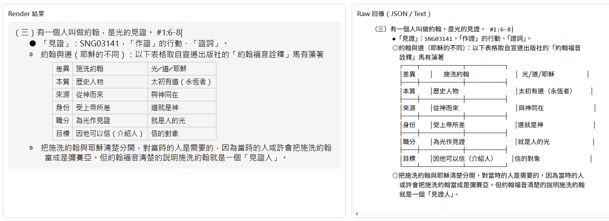

#### 以斯帖記 背景

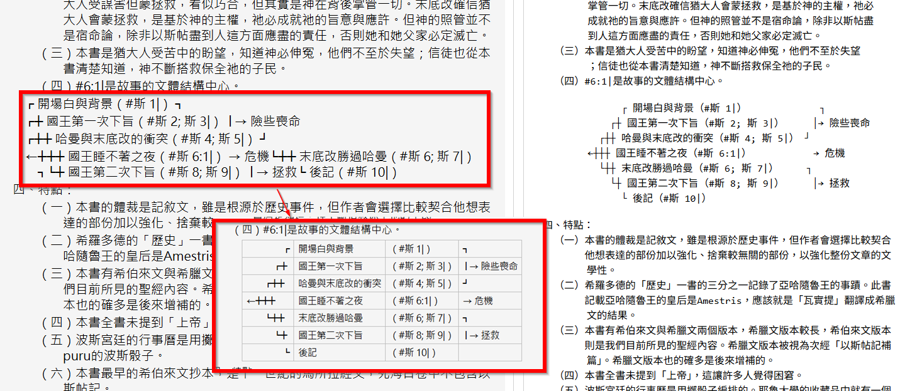

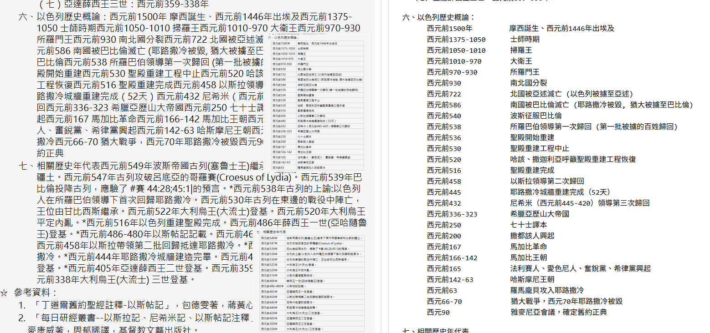

#### 歷代志上/列王紀上 背景

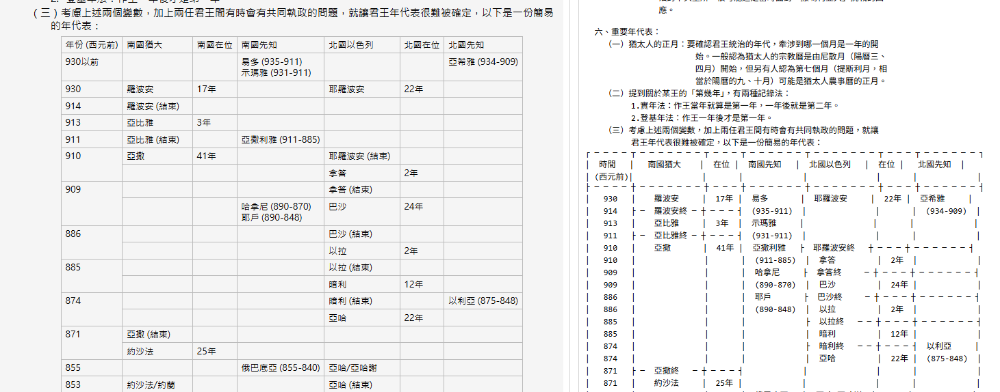

#### 以賽亞書 背景

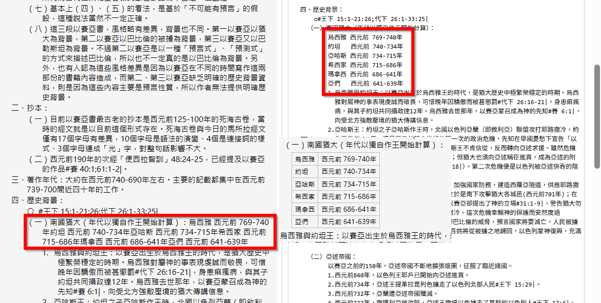

#### 賽7:10 兆

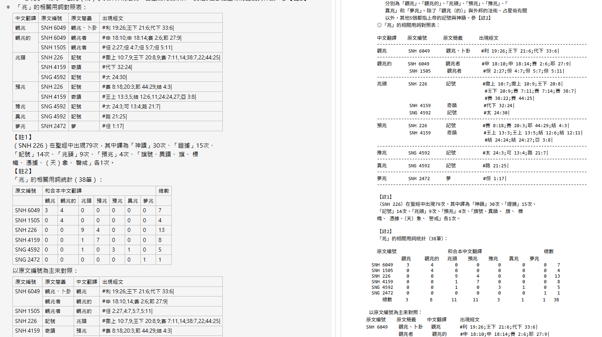

#### 規劃 DText 使其支援註釋 架構

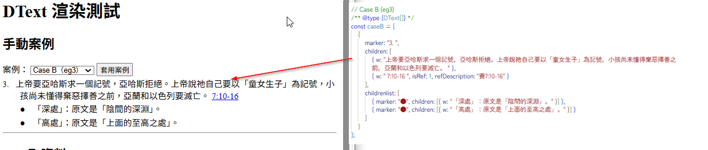

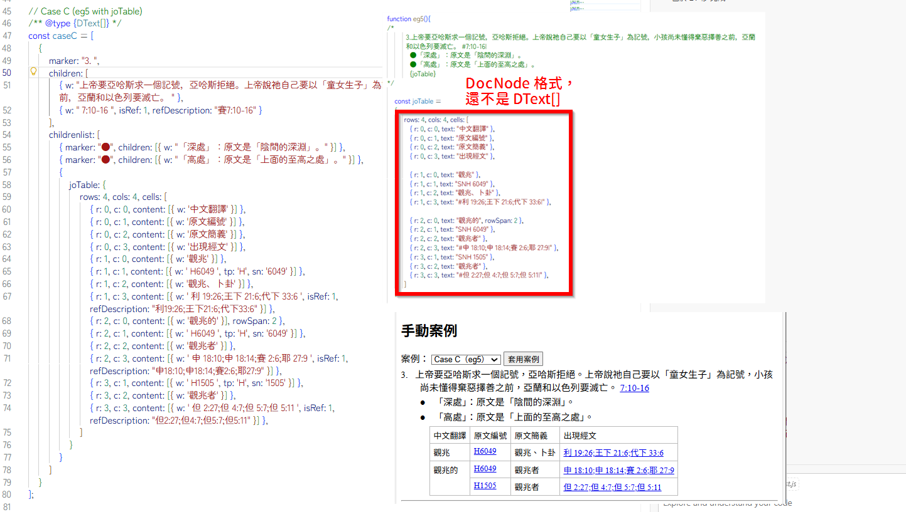

#### 關鍵

- DText 的 children 是 inline 內容，不能作為 list 用途，所以要新增一個 childrenlist 來放 list 的內容。
- joTable 要展開，不能保持原樣，這樣才能對文字進行 parsing ，若有 ref 與 sn 才能被解析出來

#### 整點至主程式

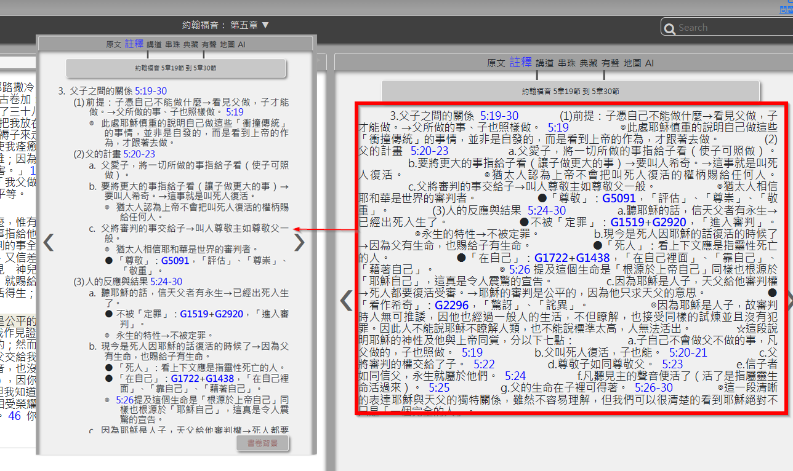

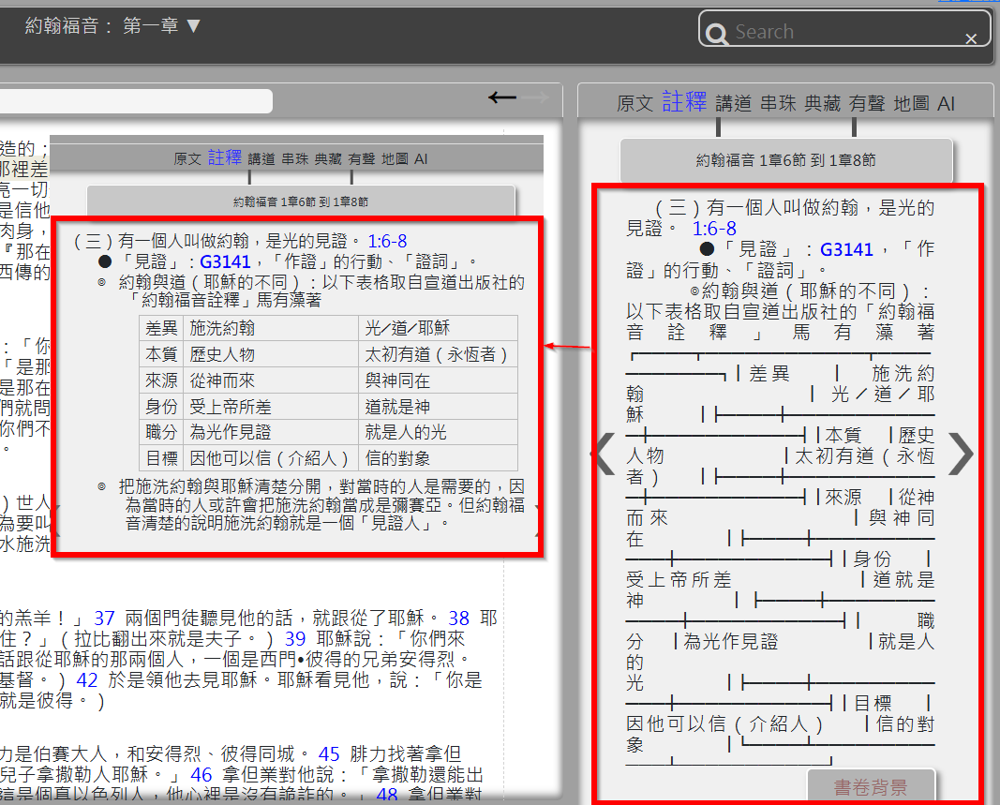

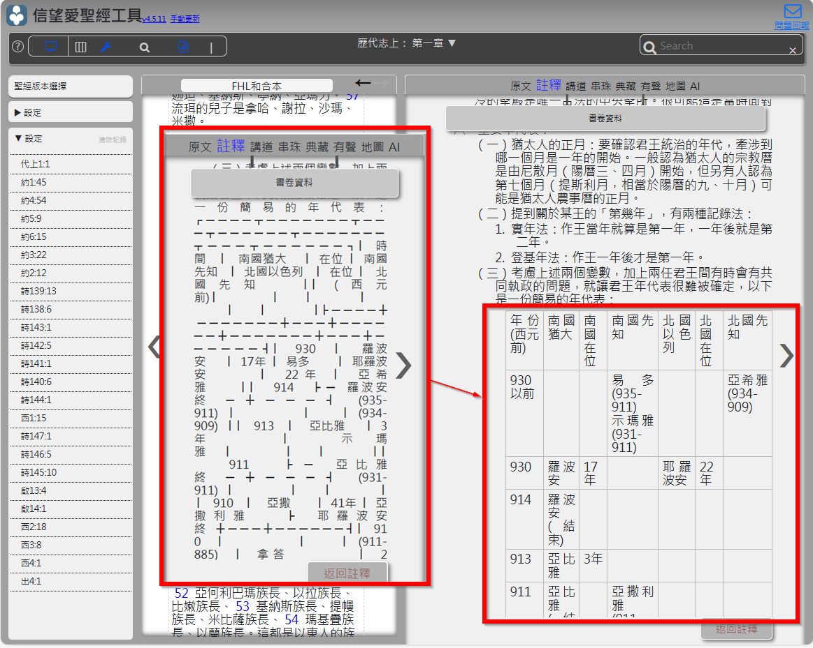