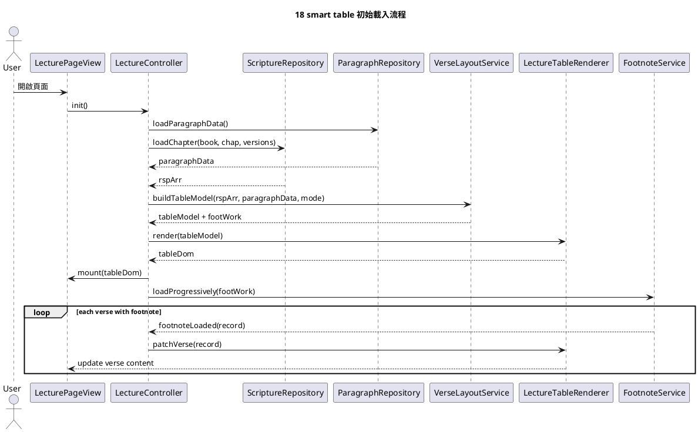
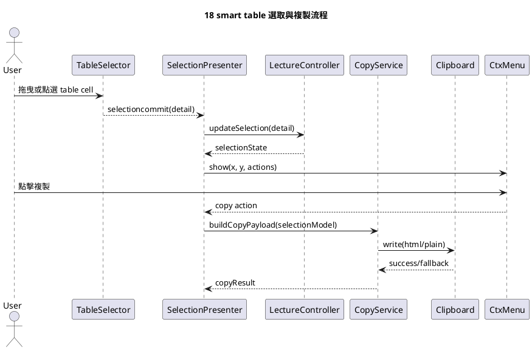

# PlantUML 互動循序圖

這份文件放兩條最值得先討論的流程：初始載入，以及選取後複製。

## 1. 初始載入與注腳漸進更新

### 討論重點

1. `FootnoteService` 只回報資料更新，不直接 query DOM。
2. `VerseLayoutService` 產出穩定 model，讓 mode 切換與 renderer 解耦。
3. `LectureController` 做流程協調，不做細部 DOM 拼裝。

## 2. 選取與複製

### 討論重點

1. `TableSelector` 應只輸出事件，不更新 badge 或 copyOutput。
2. `SelectionPresenter` 專心處理使用者回饋。
3. `CopyService` 專心處理資料匯出與 clipboard 寫入。