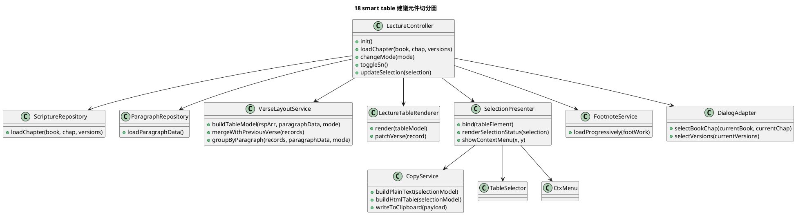

# PlantUML 元件切分圖

這張圖不是要先決定最後 class 名稱，而是用來確認切分後每個元件的責任與邊界。

## 切分原則

1. controller 負責流程，不負責細部畫面組裝。
2. renderer 負責 DOM，不負責遠端查詢。
3. service 負責規則與 use case，不直接操作頁面狀態面板。
4. adapter 負責外部系統，不讓 `window.Ijnjs` 散落在 controller 之外。

## 實作時的注意點

1. 不要為了拆檔而拆檔，先沿著變動來源切。
2. 先保留 `TableSelector` 與 `CtxMenu` 這類邊界本來就清楚的模組。
3. 若 renderer 抽出後還依賴一堆全域 state，代表只是把舊耦合搬家，不算真正解耦。