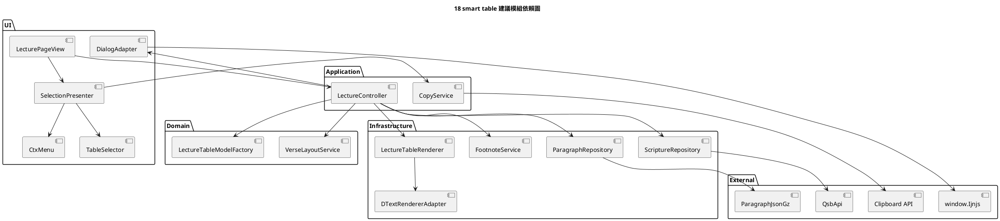

# PlantUML 模組依賴圖

這張圖用來討論「誰可以依賴誰」。

目前版本的問題不是模組太少，而是依賴方向全都收斂到單一 script。重構時應讓依賴方向變成單向流動，而不是 renderer、copy、service 都直接碰 DOM 與全域狀態。

## 討論重點

1. `LectureController` 應該成為 orchestration 中心，但不要親自產生 DOM。
2. `LectureTableRenderer` 只能依賴 render 所需資料，不應反向知道 controller state。
3. `FootnoteService` 與 `DialogAdapter` 都屬於外部整合點，應被包住，不要直接散落在主檔。
4. `CopyService` 只吃選取模型，不直接碰頁面按鈕或 badge。